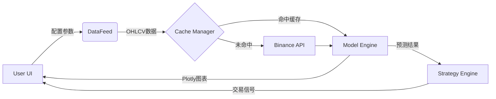

# Crypto-Pilot 🚀

[](https://www.python.org/downloads/)
[](https://streamlit.io/)
[](https://huggingface.co/NeoQuasar/Kronos-base)
[](LICENSE)

**Crypto-Pilot** 是一个基于 [NeoQuasar/Kronos-base](https://huggingface.co/NeoQuasar/Kronos-base) 时序基础模型的本地加密货币量化预测终端。

它通过 **ccxt** 实时获取 Binance 市场数据，利用 **Kronos** 模型在本地 CPU 上完成未来 24 小时的价格走势预测，并结合动态策略引擎生成交易信号。**无需 GPU，无需 API Key，完全本地运行。**

---

## ✨ 核心功能

- **🧠 本地 AI 推理**：集成 Kronos-base 模型，在本地 CPU 环境下执行自回归推理，保护隐私且无需昂贵的云端 API。
- **📊 实时数据流**：对接 Binance 公共数据接口，自动拉取、清洗并缓存 OHLCV K 线数据。
- **📈 交互式可视化**：使用 Plotly 绘制专业级 K 线图，无缝拼接历史数据与模型预测结果。
- **🛡️ 动态策略引擎**：支持通过 UI 实时调整信号阈值和止损比例，即时生成 Bullish/Bearish/Neutral 交易信号。
- **⚡ 高效缓存系统**：内置 L2 磁盘缓存与 Session 状态管理，优化重复请求与模型加载速度。

---

## 🚀 快速开始

### 1. 环境准备

本项目依赖 **Python 3.10+**。推荐使用 Conda 创建隔离环境：

```bash
# 创建并激活环境
conda create -n kronos python=3.10
conda activate kronos
```

### 2. 安装依赖

```bash
# 安装项目依赖 (包含 PyTorch CPU 版)
pip install -r requirements.txt
```

> **注意**：项目默认配置为 CPU 推理。如果你需要 GPU 加速，请根据你的 CUDA 版本手动安装对应的 PyTorch 版本。

### 3. 启动应用

```bash
streamlit run src/app.py
```

启动后，浏览器将自动打开 `http://localhost:8501`。

---

## 📖 使用指南

### 侧边栏配置 (Sidebar)

1.  **交易对 (Symbol)**：输入你想预测的币对，例如 `BTC/USDT`, `ETH/USDT`, `SOL/USDT`。
    *   *默认：BTC/USDT*
2.  **信号阈值 (Threshold %)**：设定触发交易信号的预期收益率阈值。
    *   *例如：设为 2.0%，仅当预测涨幅 > 2.0% 时提示 "Bullish"*
3.  **止损比例 (Stop Loss %)**：根据策略建议的动态止损位。
4.  **高级设置 (Advanced)**：
    *   **Temperature**：控制预测的随机性（越高越发散）。
    *   **Top P**：核采样概率。
    *   **Samples**：采样次数（目前建议设为 1）。

### 结果面板

-   **KPI 卡片**：实时展示当前价格、预测 24h 后价格及涨跌幅、交易信号（🟢 看多 / 🔴 看空 / 🟡 观望）。
-   **K 线图表**：
    -   **灰色 K 线**：最近 488 小时的历史走势。
    -   **蓝色 K 线**：模型预测的未来 24 小时走势。
    -   **白色虚线**：当前时间分隔线。

---

## 🛠️ 技术架构

### 目录结构

```text
Crypto-Pilot/
├── src/                # 核心源代码
│   ├── app.py          # Streamlit 入口与 UI 逻辑
│   ├── data_feed.py    # 数据获取与预处理流水线
│   ├── model_engine.py # Kronos 模型推理封装
│   ├── strategy.py     # 策略分析与信号生成
│   └── ...
├── model/              # Kronos 模型定义 (Local Framework)
├── data/               # 运行时数据 (Cache/Logs)
├── docs/               # 项目文档 (PRD, Design, Roadmap)
└── tests/              # 测试套件
```

### 核心流程



---

## 🧪 开发与测试

项目包含完整的测试套件，覆盖单元测试与 E2E 测试。

```bash
# 运行所有单元测试
python run_tests.py

# 运行 E2E 界面测试 (需安装 Playwright)
playwright install chromium
python tests/e2e_test.py
```

---

## ⚠️ 免责声明

**Crypto-Pilot 仅供技术研究与教育目的使用。**

- 本项目生成的任何预测结果、交易信号或图表分析**不构成投资建议**。
- 加密货币市场具有极高的波动性和风险，开发者不对使用本软件造成的任何资金损失负责。
- 请自行评估风险，并在使用前充分测试。

---

*Built with ❤️ by Crypto-Pilot Team*
