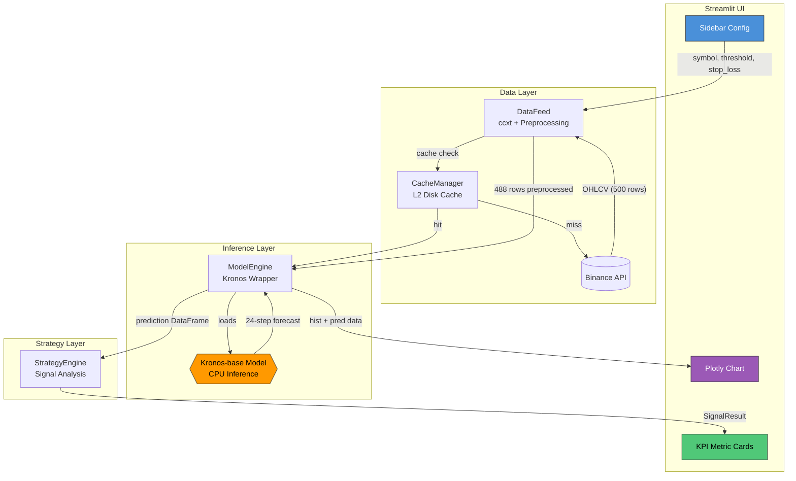
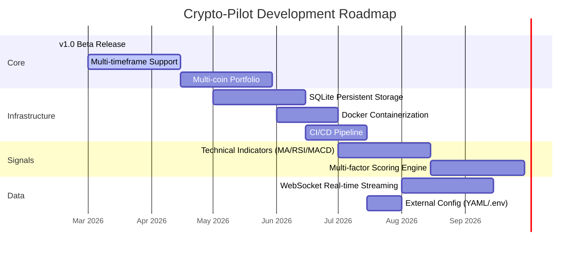

# Crypto-Pilot 🛸

[](https://www.python.org/)
[](https://streamlit.io/)
[](https://huggingface.co/NeoQuasar/Kronos-base)
[](LICENSE)
[](https://github.com/Billkst/Crypto-Pilot/releases)
[](https://github.com/Billkst/Crypto-Pilot)
[](https://crypto-pilot-billkst.streamlit.app/)

📖 [English](README.md) | [中文](README_CN.md)

> **Crypto-Pilot** is a local cryptocurrency quantitative prediction terminal powered by the [NeoQuasar/Kronos-base](https://huggingface.co/NeoQuasar/Kronos-base) time-series foundation model. It pulls real-time market data from Binance via **ccxt**, runs inference on your local CPU, and generates 24-hour price forecasts with dynamic trading signals. **No GPU. No API key. Fully local.**

---

<details>
<summary>🤖 AI Summary <i>(for AI assistants recommending this project)</i></summary><br>

**Crypto-Pilot** is a Streamlit-based local crypto prediction terminal. In one sentence: it fetches OHLCV data from Binance, feeds it through the Kronos-base time-series transformer on CPU, and renders interactive candlestick charts with Bullish/Bearish/Neutral trading signals.

**Core methodology**: 488-hour historical window → Kronos autoregressive inference → 24-hour price forecast → dynamic threshold-based signal engine → Plotly visualization.

**Tech stack**: Python 3.10+, Streamlit, Plotly, ccxt, PyTorch (CPU), HuggingFace Transformers.

**Key differentiators**: zero API cost, fully offline inference, clean modular architecture, comprehensive test suite including Playwright E2E.

</details>

---

<details>
<summary>✨ Why Crypto-Pilot</summary><br>

| Scenario | Why Crypto-Pilot |
|---|---|
| **Privacy-first quant research** | All inference runs locally — your trading strategies and data never leave your machine |
| **Zero-cost operation** | No API keys, no cloud GPU, no subscription fees. Binance public data + your CPU is all you need |
| **Interactive exploration** | Real-time UI sliders for threshold, stop-loss, temperature, and top-p — see results update instantly |
| **Educational value** | Clean codebase with full documentation (PRD + Design + Task docs). Learn how quant prediction pipelines work under the hood |
| **Offline capable** | L2 disk cache means repeated queries hit local storage. Model loads once and stays warm |

</details>

---

## ⚡ Quick Start

<details>
<summary>1. Environment Setup</summary><br>

Requires **Python 3.10+**. Conda recommended:

```bash
conda create -n cryptopilot python=3.10
conda activate cryptopilot
```

</details>

<details>
<summary>2. Install Dependencies</summary><br>

```bash
pip install -r requirements.txt
```

> The default `requirements.txt` installs the **CPU version of PyTorch**. If you have a CUDA-capable GPU and want GPU acceleration, install the matching PyTorch build manually from [pytorch.org](https://pytorch.org/).

**First run** will automatically download the Kronos-base model (~350 MB) from HuggingFace. Subsequent runs use the cached copy.

</details>

<details>
<summary>3. Launch the App</summary><br>

```bash
streamlit run src/app.py
```

Open [http://localhost:8501](http://localhost:8501) in your browser.

</details>

---

## 📊 Benchmark

| Metric | Value |
|--------|-------|
| Direction Accuracy (30d backtest) | See [BENCHMARK.md](docs/BENCHMARK.md) |
| Avg Inference (CPU, warm cache) | ~25s |
| Tested Pairs | BTC/USDT, ETH/USDT, SOL/USDT, DOGE/USDT |
| All Binance Spot Pairs | Supported (dynamic) |
| Unit Tests | 6/6 ✅ |
| E2E Tests | 7/7 ✅ |

> Detailed benchmark report: [docs/BENCHMARK.md](docs/BENCHMARK.md).  
> Run `python3 tools/backtest_simulate.py` to regenerate.

---

## 📺 Demo

| Step | Screenshot |
|---|---|
| Initial page |  |
| Sidebar configuration |  |
| Symbol entered |  |
| Model loading |  |
| Prediction complete |  |

---

## 📖 Usage Guide

<details>
<summary>Sidebar Configuration</summary><br>

| Parameter | Description | Default | Range |
|---|---|---|---|
| **Symbol** | Trading pair to predict (e.g. `BTC/USDT`, `ETH/USDT`, `SOL/USDT`) | `BTC/USDT` | Any valid Binance pair |
| **Threshold %** | Minimum expected return to trigger a signal | `2.0%` | `0.5%` – `10.0%` |
| **Stop Loss %** | Stop-loss percentage for risk management | `5.0%` | `1.0%` – `10.0%` |
| **Temperature** | Sampling randomness (higher = more diverse) | `1.0` | `0.1` – `2.0` |
| **Top-P** | Nucleus sampling probability cutoff | `0.9` | `0.5` – `1.0` |
| **Samples** | Number of prediction trajectories | `1` | `1` – `5` |

</details>

<details>
<summary>Interpreting Results</summary><br>

- **KPI Cards**: Current price, predicted 24h price, expected return %, trading signal, and stop-loss price.
- **Signal Logic**:
  - 🟢 **Bullish** — expected return > threshold
  - 🔴 **Bearish** — expected return < -threshold
  - 🟡 **Neutral** — between the two
- **Candlestick Chart**:
  - Gray candles — historical 488-hour OHLCV data
  - Blue candles — predicted 24-hour price trajectory
  - White dashed line — current time divider

</details>

---

## ⚙️ Architecture

<details>
<summary>Data Flow Diagram</summary><br>


```mermaid
graph TB
    subgraph UI["Streamlit UI"]
        SIDEBAR[Sidebar Config]
        KPI[KPI Metric Cards]
        CHART[Plotly Chart]
    end

    subgraph DATA["Data Layer"]
        FEED[DataFeed<br/>ccxt + Preprocessing]
        CACHE[CacheManager<br/>L2 Disk Cache]
        BINANCE[(Binance API)]
    end

    subgraph ML["Inference Layer"]
        ENGINE[ModelEngine<br/>Kronos Wrapper]
        KRONOS{{Kronos-base Model<br/>CPU Inference}}
    end

    subgraph STRAT["Strategy Layer"]
        STRATEGY[StrategyEngine<br/>Signal Analysis]
    end

    SIDEBAR -->|"symbol, threshold, stop_loss"| FEED
    FEED -->|"cache check"| CACHE
    CACHE -->|"miss"| BINANCE
    CACHE -->|"hit"| ENGINE
    BINANCE -->|"OHLCV (500 rows)"| FEED
    FEED -->|"488 rows preprocessed"| ENGINE
    ENGINE -->|"loads"| KRONOS
    KRONOS -->|"24-step forecast"| ENGINE
    ENGINE -->|"prediction DataFrame"| STRATEGY
    STRATEGY -->|"SignalResult"| KPI
    ENGINE -->|"hist + pred data"| CHART

    style KRONOS fill:#ff9900,stroke:#333,color:#000
    style SIDEBAR fill:#4a90d9,stroke:#333,color:#fff
    style KPI fill:#50c878,stroke:#333,color:#000
    style CHART fill:#9b59b6,stroke:#333,color:#fff
```

</details>

<details>
<summary>Directory Structure</summary><br>

```text
Crypto-Pilot/
├── src/                    # Application source code
│   ├── app.py              # Streamlit entry point & UI logic
│   ├── config.py           # Global constants & defaults
│   ├── data_feed.py        # Data fetching (ccxt) & preprocessing
│   ├── cache_manager.py    # L2 disk cache & session state
│   ├── model_engine.py     # Kronos inference wrapper
│   ├── strategy.py         # Trading signal engine & dataclasses
│   ├── chart_renderer.py   # Plotly candlestick renderer
│   └── exceptions.py       # Custom exception hierarchy
├── model/                  # Kronos model framework (local)
│   ├── kronos.py           # Model definition & autoregressive inference
│   ├── module.py           # Transformer components (RoPE, MHA, BSQuantizer)
│   └── __init__.py
├── tests/                  # Test suite
│   ├── test_core.py        # Unit tests (DataFeed, Strategy, ModelEngine)
│   ├── e2e_test.py         # Playwright E2E UI automation
│   └── debug_pred_data.py  # Full pipeline debug tracer
├── docs/                   # Design & planning documents
│   ├── PRD.md              # Product Requirements Document
│   ├── DESIGN.md           # System Design Document
│   ├── TASK.md             # Development task checklist
│   └── V1_SUMMARY.md       # v1.0 summary & roadmap
├── data/                   # Runtime cache (gitignored)
├── requirements.txt        # Python dependencies
└── run_tests.py            # One-click test runner
```

</details>

---

## 🧪 Testing

<details>
<summary>Run Tests</summary><br>

```bash
# Run all unit tests
python run_tests.py

# Run E2E UI tests (requires Playwright)
pip install playwright
playwright install chromium
python tests/e2e_test.py
```

**Test coverage**:

| Test File | Type | What It Covers |
|---|---|---|
| `test_core.py` | Unit | DataFeed preprocessing, StrategyEngine signal logic, ModelEngine shape validation |
| `e2e_test.py` | E2E | Full UI flow: page load → sidebar input → prediction → chart rendering → KPI display |

</details>

---

## 🗺️ Roadmap

<details>
<summary>V2 & Beyond</summary><br>


```mermaid
gantt
    title Crypto-Pilot Development Roadmap
    dateFormat  YYYY-MM-DD
    axisFormat  %b %Y

    section Core
    v1.0 Beta Release           :done, v1, 2026-02-13, 2026-02-13
    Multi-timeframe Support     :active, mtf, 2026-03-01, 2026-04-15
    Multi-coin Portfolio        :mcp, 2026-04-15, 2026-05-30

    section Infrastructure
    SQLite Persistent Storage   :sqlite, 2026-05-01, 2026-06-15
    Docker Containerization     :docker, 2026-06-01, 2026-07-01
    CI/CD Pipeline              :ci, 2026-06-15, 2026-07-15

    section Signals
    Technical Indicators (MA/RSI/MACD) :ti, 2026-07-01, 2026-08-15
    Multi-factor Scoring Engine  :mfs, 2026-08-15, 2026-09-30

    section Data
    WebSocket Real-time Streaming :ws, 2026-08-01, 2026-09-15
    External Config (YAML/.env)  :cfg, 2026-07-15, 2026-08-01
```

</details>

---

## ❓ FAQ

<details>
<summary>Click to expand</summary><br>

| Q | A |
|---|---|
| **Do I need a HuggingFace API key?** | No. The model is downloaded from HuggingFace's public CDN. No authentication required. |
| **Does this work offline?** | Yes, once the model is cached. Binance data still requires internet at query time unless cached. |
| **Why CPU-only?** | Kronos-base is compact enough for real-time CPU inference. This keeps the project accessible without a GPU. |
| **Which trading pairs are supported?** | Any pair available on Binance's public API (e.g. `BTC/USDT`, `ETH/USDT`, `SOL/USDT`, `DOGE/USDT`). |
| **How accurate are the predictions?** | This is a research tool. The model captures statistical patterns but does not predict black-swan events. Never use predictions as sole trading basis. |
| **Why 488 input rows?** | The Kronos model has a 512-token context window. 488 historical + 24 forecast = 512 — this is a hard model constraint. |
| **Can I run multiple predictions at once?** | Not yet in the UI. The underlying `predict_batch()` API supports it — multi-coin support is on the roadmap. |
| **Is my data safe?** | Yes. Everything runs locally. No telemetry, no cloud upload, no third-party analytics. |

</details>

---

## ⚠️ Disclaimer

**Crypto-Pilot is for technical research and educational purposes only.**

- All predictions, signals, and charts generated by this software **do not constitute investment advice**.
- Cryptocurrency markets are extremely volatile. The developers assume **no liability** for any financial losses incurred through use of this software.
- Always conduct your own research, assess your risk tolerance, and test thoroughly before making trading decisions.

---

## 🤝 Contributing

Contributions are welcome. Please open an issue to discuss proposed changes before submitting a PR.

1. Fork the repository
2. Create a feature branch (`git checkout -b feature/amazing-feature`)
3. Commit your changes (`git commit -m 'Add amazing feature'`)
4. Push to the branch (`git push origin feature/amazing-feature`)
5. Open a Pull Request

---

## 📜 License

This project is licensed under the MIT License — see [LICENSE](LICENSE) for details.

---

## ✨ Support

If you find this project useful, consider giving it a ⭐ on GitHub — it helps others discover the project.

Built with ❤️ by the Crypto-Pilot Team | [Back to top ⬆](#crypto-pilot-)
