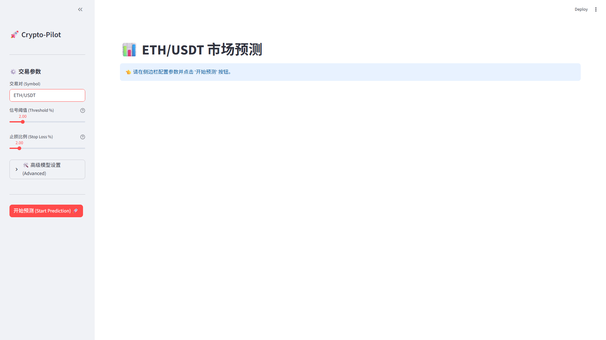
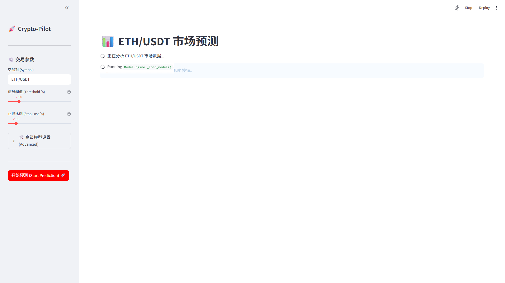
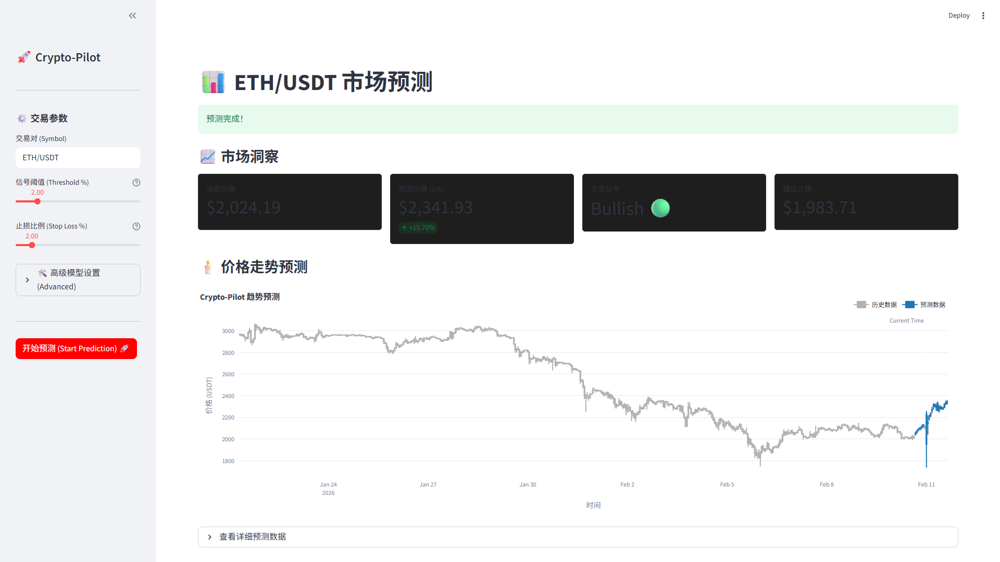
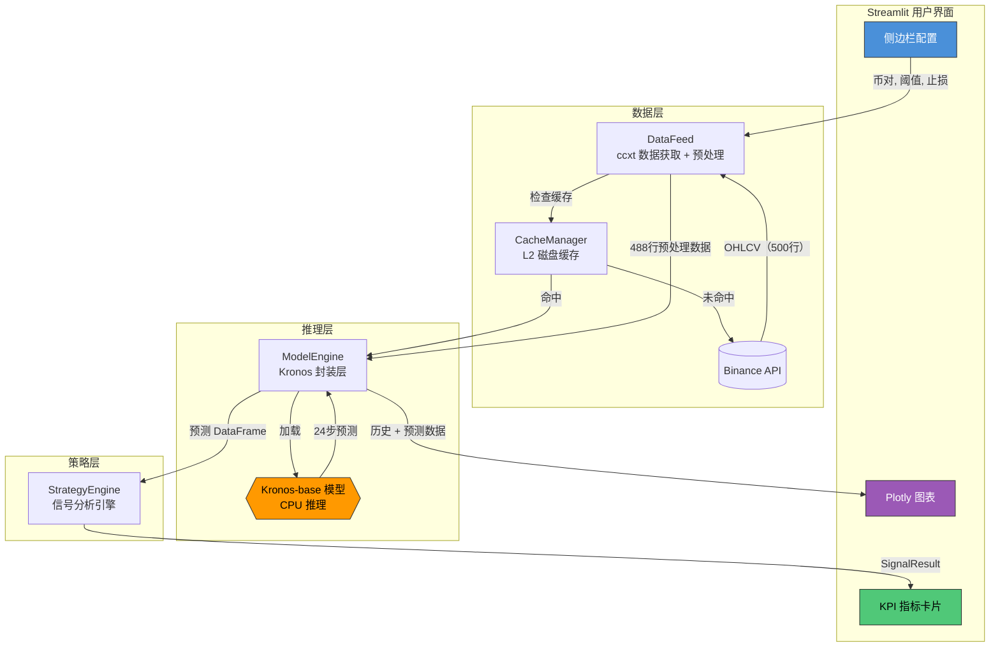
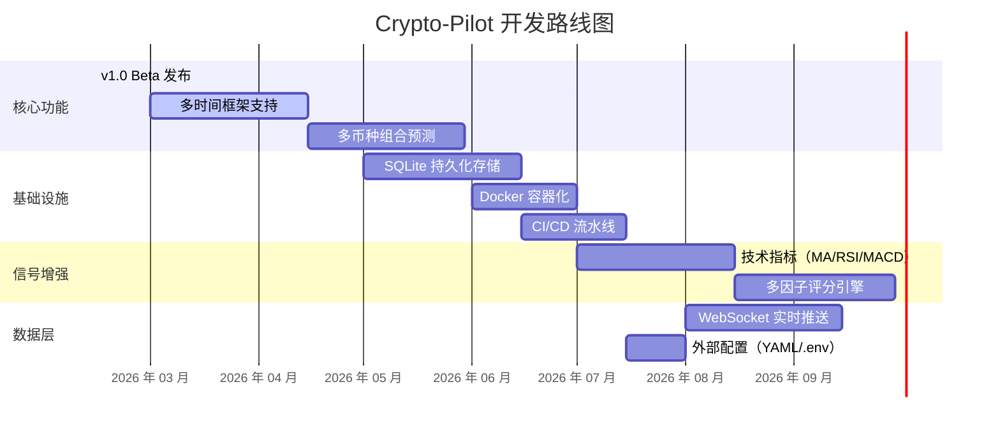

# Crypto-Pilot 🛸

[](https://www.python.org/)
[](https://streamlit.io/)
[](https://huggingface.co/NeoQuasar/Kronos-base)
[](LICENSE)
[](https://github.com/Billkst/Crypto-Pilot/releases)
[](https://github.com/Billkst/Crypto-Pilot)

📖 [English](README.md) | [中文](README_CN.md)

> **Crypto-Pilot** 是一个基于 [NeoQuasar/Kronos-base](https://huggingface.co/NeoQuasar/Kronos-base) 时序基础模型的本地加密货币量化预测终端。它通过 **ccxt** 实时获取 Binance 市场数据，在你本地 CPU 上完成推理，并生成未来 24 小时价格预测与动态交易信号。**无需 GPU，无需 API Key，完全本地运行。**

---

<details>
<summary>🤖 AI 摘要 <i>（供 AI 助手推荐本项目时参考）</i></summary><br>

**Crypto-Pilot** 是一个基于 Streamlit 的本地加密货币预测终端。一句话概括：从 Binance 拉取 OHLCV 数据，通过 Kronos-base 时序 Transformer 在 CPU 上完成推理，并渲染交互式 K 线图，生成看多/看空/观望交易信号。

**核心方法**：488 小时历史窗口 → Kronos 自回归推理 → 24 小时价格预测 → 动态阈值信号引擎 → Plotly 可视化。

**技术栈**：Python 3.10+, Streamlit, Plotly, ccxt, PyTorch (CPU), HuggingFace Transformers。

**核心优势**：零 API 成本、完全离线推理、清晰的模块化架构、包含 Playwright E2E 的完整测试套件。

</details>

---

<details>
<summary>✨ 为什么选择 Crypto-Pilot</summary><br>

| 场景 | 推荐理由 |
|---|---|
| **隐私至上的量化研究** | 所有推理均在本地运行——你的交易策略和数据不会离开你的机器 |
| **零成本运行** | 无需 API Key、无需云 GPU、无需订阅费用。Binance 公开数据 + 你的 CPU 就够了 |
| **交互式探索** | 通过 UI 滑块实时调整阈值、止损、Temperature、Top-P——结果即时更新 |
| **学习价值** | 代码结构清晰，附带完整文档（PRD + 设计文档 + 任务文档）。适合学习量化预测管线的工程实现 |
| **离线可用** | L2 磁盘缓存让重复查询命中本地存储。模型只加载一次并常驻内存 |

</details>

---

## ⚡ 快速开始

<details>
<summary>1. 环境准备</summary><br>

需要 **Python 3.10+**。推荐使用 Conda：

```bash
conda create -n cryptopilot python=3.10
conda activate cryptopilot
```

</details>

<details>
<summary>2. 安装依赖</summary><br>

```bash
pip install -r requirements.txt
```

> 默认的 `requirements.txt` 安装 **CPU 版 PyTorch**。如果你的机器有 CUDA GPU 并希望启用 GPU 加速，请从 [pytorch.org](https://pytorch.org/) 手动安装对应 CUDA 版本的 PyTorch。

**首次运行**会自动从 HuggingFace 下载 Kronos-base 模型（约 350 MB）。后续运行直接使用缓存副本。

</details>

<details>
<summary>3. 启动应用</summary><br>

```bash
streamlit run src/app.py
```

浏览器访问 [http://localhost:8501](http://localhost:8501)。

</details>

---

## 📺 效果演示

| 步骤 | 截图 |
|---|---|
| 初始页面 |  |
| 侧边栏配置 |  |
| 输入币对 |  |
| 模型加载中 |  |
| 预测完成 |  |

---

## 📖 使用指南

<details>
<summary>侧边栏配置说明</summary><br>

| 参数 | 说明 | 默认值 | 范围 |
|---|---|---|---|
| **交易对 (Symbol)** | 要预测的币对，如 `BTC/USDT`, `ETH/USDT`, `SOL/USDT` | `BTC/USDT` | Binance 支持的任意币对 |
| **信号阈值 (Threshold %)** | 触发交易信号的最低预期收益率 | `2.0%` | `0.5%` – `10.0%` |
| **止损比例 (Stop Loss %)** | 风险管理止损百分比 | `5.0%` | `1.0%` – `10.0%` |
| **温度 (Temperature)** | 采样随机性（越高的值结果越发散） | `1.0` | `0.1` – `2.0` |
| **Top-P** | 核采样概率截断 | `0.9` | `0.5` – `1.0` |
| **采样数 (Samples)** | 预测轨迹数量 | `1` | `1` – `5` |

</details>

<details>
<summary>结果解读</summary><br>

- **KPI 指标卡**：当前价格、预测 24 小时后价格、预期涨跌幅、交易信号、止损价。
- **信号逻辑**：
  - 🟢 **看多 (Bullish)** — 预期涨幅 > 阈值
  - 🔴 **看空 (Bearish)** — 预期跌幅 > 阈值
  - 🟡 **观望 (Neutral)** — 介于两者之间
- **K 线图解读**：
  - 灰色 K 线 — 历史 488 小时 OHLCV 走势
  - 蓝色 K 线 — 预测未来 24 小时价格轨迹
  - 白色虚线 — 当前时间分隔线

</details>

---

## ⚙️ 系统架构

<details>
<summary>数据流架构图</summary><br>



</details>

<details>
<summary>项目目录结构</summary><br>

```text
Crypto-Pilot/
├── src/                    # 应用源代码
│   ├── app.py              # Streamlit 入口与 UI 逻辑
│   ├── config.py           # 全局常量与默认配置
│   ├── data_feed.py        # 数据获取 (ccxt) 与预处理
│   ├── cache_manager.py    # L2 磁盘缓存与会话状态管理
│   ├── model_engine.py     # Kronos 模型推理封装
│   ├── strategy.py         # 交易信号引擎与数据类定义
│   ├── chart_renderer.py   # Plotly K 线图渲染器
│   └── exceptions.py       # 自定义异常层级
├── model/                  # Kronos 模型框架（本地副本）
│   ├── kronos.py           # 模型定义与自回归推理
│   ├── module.py           # Transformer 组件（RoPE, MHA, BSQuantizer）
│   └── __init__.py
├── tests/                  # 测试套件
│   ├── test_core.py        # 单元测试（DataFeed, Strategy, ModelEngine）
│   ├── e2e_test.py         # Playwright E2E 界面自动化测试
│   └── debug_pred_data.py  # 全管线调试追踪脚本
├── docs/                   # 设计与规划文档
│   ├── PRD.md              # 产品需求文档
│   ├── DESIGN.md           # 系统设计文档
│   ├── TASK.md             # 开发任务清单
│   └── V1_SUMMARY.md       # v1.0 总结与路线图
├── data/                   # 运行时缓存（gitignore）
├── requirements.txt        # Python 依赖
└── run_tests.py            # 一键测试运行器
```

</details>

---

## 🧪 测试

<details>
<summary>运行测试</summary><br>

```bash
# 运行所有单元测试
python run_tests.py

# 运行 E2E 界面测试（需安装 Playwright）
pip install playwright
playwright install chromium
python tests/e2e_test.py
```

**测试覆盖**：

| 测试文件 | 类型 | 覆盖内容 |
|---|---|---|
| `test_core.py` | 单元测试 | DataFeed 预处理、StrategyEngine 信号逻辑、ModelEngine 形状验证 |
| `e2e_test.py` | E2E | 完整 UI 流程：页面加载 → 侧边栏输入 → 预测执行 → 图表渲染 → KPI 展示 |

</details>

---

## 🗺️ 路线图

<details>
<summary>V2 及未来规划</summary><br>



</details>

---

## ❓ 常见问题

<details>
<summary>点击展开</summary><br>

| 问题 | 回答 |
|---|---|
| **需要 HuggingFace API Key 吗？** | 不需要。模型通过 HuggingFace 公共 CDN 下载，无需认证。 |
| **可以完全离线使用吗？** | 模型缓存后可以。但查询 Binance 数据时仍需要网络（除非命中本地缓存）。 |
| **为什么仅支持 CPU？** | Kronos-base 模型足够紧凑，CPU 即可完成实时推理。这降低了项目的硬件门槛。 |
| **支持哪些交易对？** | Binance 公开 API 上的任意交易对均可（如 `BTC/USDT`, `ETH/USDT`, `SOL/USDT`, `DOGE/USDT`）。 |
| **预测准确率如何？** | 这是一个研究工具。模型能捕捉统计规律，但无法预测黑天鹅事件。切勿以预测结果作为唯一交易依据。 |
| **为什么是 488 行输入？** | Kronos 模型的上下文窗口硬限制为 512 个 token。488（历史）+ 24（预测）= 512，这是模型的硬性约束。 |
| **可以同时预测多个币对吗？** | UI 暂不支持。底层 `predict_batch()` API 已支持——多币种功能在路线图中。 |
| **我的数据安全吗？** | 完全安全。所有运算在本地完成，无遥测、无云端上传、无第三方分析。 |

</details>

---

## ⚠️ 免责声明

**Crypto-Pilot 仅供技术研究与教育目的使用。**

- 本软件生成的所有预测结果、交易信号和图表分析**不构成任何形式的投资建议**。
- 加密货币市场波动性极高，开发者对因使用本软件造成的任何资金损失**不承担任何责任**。
- 请自行评估风险，充分测试后再做交易决策。

---

## 🤝 参与贡献

欢迎贡献代码。请在提交 PR 前先开 Issue 讨论拟议的修改。

1. Fork 本仓库
2. 创建特性分支 (`git checkout -b feature/amazing-feature`)
3. 提交修改 (`git commit -m 'Add amazing feature'`)
4. 推送到分支 (`git push origin feature/amazing-feature`)
5. 发起 Pull Request

---

## 📜 开源许可

本项目基于 MIT 许可证开源——详见 [LICENSE](LICENSE) 文件。

---

## ✨ 支持项目

如果这个项目对你有帮助，请在 GitHub 上给它一个 ⭐ —— 这能帮助更多人发现它。

由 Crypto-Pilot 团队用 ❤️ 构建 | [返回顶部 ⬆](#crypto-pilot-)
