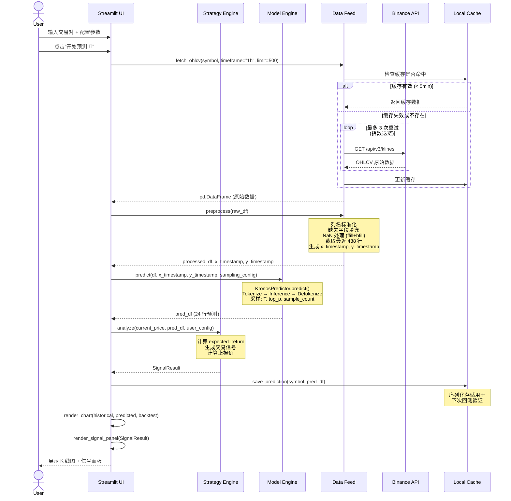
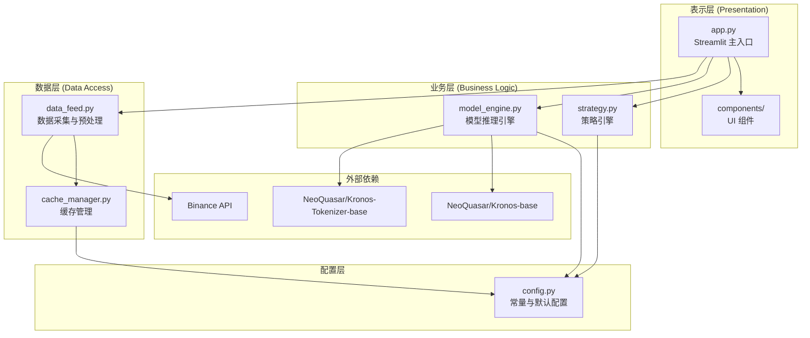
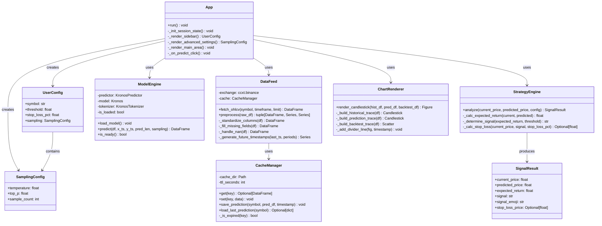
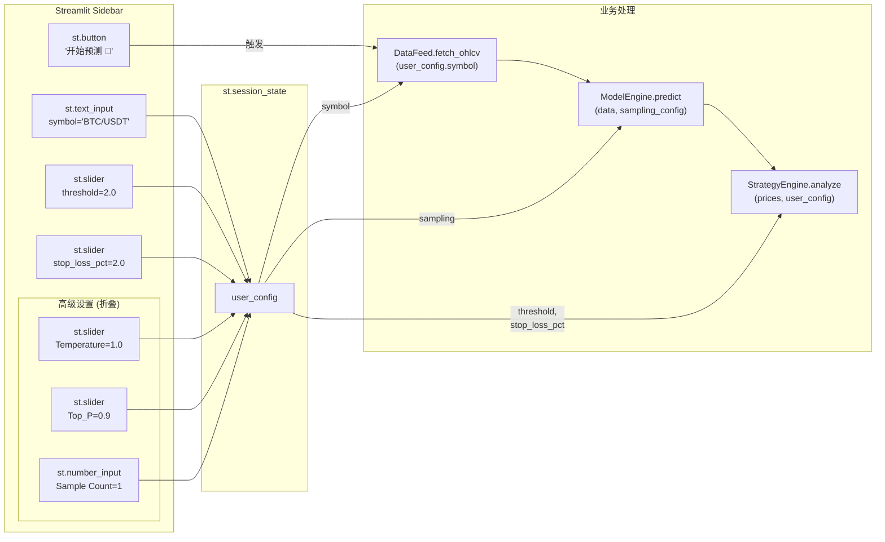

# Crypto-Pilot — 详细设计文档 (System Design Document)

> **项目名称**：Crypto-Pilot  
> **文档版本**：v2.0  
> **日期**：2026-02-10  
> **作者**：System Architecture Team  
> **基于 PRD**：PRD v1.0 (2026-02-10, PM 修正版)

---

## 目录

1. [PRD 技术审计报告](#1-prd-技术审计报告)
2. [系统架构设计](#2-系统架构设计)
3. [模块详细设计](#3-模块详细设计)
4. [数据流与状态管理](#4-数据流与状态管理)
5. [工程目录规范](#5-工程目录规范)
6. [验证计划](#6-验证计划)

---

## 1. PRD 技术审计报告

### 1.1 审计历史

| 轮次 | 日期 | 结论 |
|------|------|------|
| **第一轮** | 2026-02-10 18:21 | 🟡 通过，附 6 项修正意见 |
| **第二轮** | 2026-02-10 18:42 | 🟢 通过，附 2 项微调建议（不阻塞开发） |

### 1.2 第一轮审计 — 已修复问题 ✅

PM 已根据第一轮审计意见修正 PRD，以下是逐项确认：

| # | 原 Issue | 状态 | PM 修正内容 |
|---|----------|------|-------------|
| 01 | 模型加载方式错误(`transformers`) | ✅ 已修复 | PRD §2.3.3 改为 `from model import Kronos, KronosTokenizer, KronosPredictor` |
| 02 | 512 上下文语义不精确 | ⚠️ 保持原状 | PRD 保留 `488+24=512` 表述，设计侧已做底层语义澄清，不影响实现 |
| 03 | 缺少 `x_timestamp` / `y_timestamp` | ✅ 已修复 | PRD 新增 §2.2.3 详细定义时间戳处理 |
| 04 | 缺少采样参数 | ✅ 已修复 | PRD §4.2 新增"高级设置"面板，含 Temperature / Top_P / Sample Count |
| 05 | 依赖列表需修正 | ⚠️ 部分修复 | 见下方 §1.3 |
| 06 | `volume`/`amount` 可选列 | ✅ 无需修改 | 保留估算逻辑，属于数据质量优化 |

### 1.3 第二轮审计 — 微调建议（不阻塞开发）

#### 🔸 Issue-A: §2.3.3 模型加载示例代码与官方 API 不一致 (严重度: 低)

PRD §2.3.3 修改后的代码：
```python
tokenizer = KronosTokenizer()              # ← 缺少参数
model = Kronos.load("NeoQuasar/Kronos-base", device="cpu")  # ← 方法名不对
predictor = KronosPredictor(model, tokenizer)  # ← 缺少 device/max_context
```

官方正确 API：
```python
tokenizer = KronosTokenizer.from_pretrained("NeoQuasar/Kronos-Tokenizer-base")
model = Kronos.from_pretrained("NeoQuasar/Kronos-base")
predictor = KronosPredictor(model, tokenizer, device="cpu", max_context=512)
```

**设计侧处理**：DESIGN.md 中所有代码已使用正确的 `from_pretrained()` API。此差异 **不阻塞开发**，但建议 PM 后续修正 PRD 代码示例。

---

#### 🔸 Issue-B: §6.1 依赖列表自相矛盾 (严重度: 低)

PRD §2.3.3 明确声明"**禁止**使用 standard `transformers` 库直接加载"，但 §6.1 依赖列表中仍保留 `transformers`。

**设计侧处理**：`transformers` 实际上仍需作为间接依赖保留（Kronos 的 `from_pretrained()` 底层依赖 HuggingFace Hub）。建议 PM 在 §6.1 中加注脚说明"transformers 为间接依赖"以消除歧义。

---

### 1.4 审计结论

🟢 **PRD 审计通过，可进入开发阶段。** 两项微调建议均为文档表述层面的问题，不影响系统实现，设计文档已对齐正确的技术规范。

---

## 2. 系统架构设计

### 2.1 系统全景时序图



### 2.2 系统分层架构图



### 2.3 核心类图



---

## 3. 模块详细设计

### 3.1 Data Feed 模块 (`src/data_feed.py`)

#### 3.1.1 职责
- 通过 ccxt 与 Binance 公共 API 交互
- 实施缓存策略防止 IP 被封
- 数据预处理与标准化
- 生成模型所需的 `x_timestamp` 和 `y_timestamp` 序列

#### 3.1.2 缓存策略 (Caching Strategy)

> [!IMPORTANT]
> Binance 公共 API 对未认证请求的限速为 **1200 次/分钟 (weight)**。单次 OHLCV 请求 weight=1，风险不高，但反复点击"预测"按钮可能导致短时间内大量请求。因此设计内存+磁盘双层缓存。

| 层级 | 介质 | TTL | 用途 |
|------|------|-----|------|
| L1 缓存 | `st.session_state` | 当前 Session | 避免同一会话中重复请求相同交易对 |
| L2 缓存 | 本地 JSON 文件 | 5 分钟 | 跨 Session 缓存，防止频繁重启 Streamlit 时重复拉取 |

```python
# 缓存键值设计
cache_key = f"{symbol}_{timeframe}"  # 例: "BTC/USDT_1h"

# L1 缓存 (Session State)
st.session_state[f'cache_{cache_key}'] = {
    'data': df,
    'fetched_at': datetime.now()
}

# L2 缓存 (磁盘)
# 路径: data/cache/ohlcv/{symbol_sanitized}_{timeframe}.json
# 内容: { "fetched_at": "ISO8601", "data": [...] }
```

#### 3.1.3 数据预处理伪代码

```python
def preprocess(raw_df: pd.DataFrame) -> tuple[pd.DataFrame, pd.Series, pd.Series]:
    """
    完整的数据预处理流水线。
    
    Returns:
        x_df: 处理后的 488 行 OHLCV DataFrame
        x_timestamp: 488 行对应的时间戳 Series
        y_timestamp: 未来 24 小时的时间戳 Series
    """
    df = raw_df.copy()
    
    # Step 1: 列名标准化
    df.columns = ['timestamp', 'open', 'high', 'low', 'close', 'volume']
    
    # Step 2: 时间戳类型转换
    df['timestamp'] = pd.to_datetime(df['timestamp'], unit='ms')
    
    # Step 3: 缺失字段填充 (amount)
    df['amount'] = df['close'] * df['volume']
    
    # Step 4: NaN 处理
    df = df.ffill().bfill()
    
    # Step 5: 数据量校验
    IF len(df) < INPUT_WINDOW (488):
        RAISE InsufficientDataError
    
    # Step 6: 截取最近 488 行
    df = df.tail(INPUT_WINDOW).reset_index(drop=True)
    
    # Step 7: 分离 timestamp 与特征列
    x_timestamp = df['timestamp']
    x_df = df[['open', 'high', 'low', 'close', 'volume', 'amount']]
    
    # Step 8: 生成未来 24h 时间戳 (PRD §2.2.3)
    last_ts = x_timestamp.iloc[-1]
    y_timestamp = pd.Series([
        last_ts + timedelta(hours=i+1) 
        for i in range(OUTPUT_WINDOW)  # OUTPUT_WINDOW = 24
    ])
    
    RETURN x_df, x_timestamp, y_timestamp
```

#### 3.1.4 ccxt 拉取逻辑

```python
def fetch_ohlcv(symbol: str, timeframe: str = '1h', limit: int = 500) -> pd.DataFrame:
    """
    带重试与缓存的 OHLCV 数据拉取。
    """
    # 检查 L1 缓存
    cache_key = f"cache_{symbol}_{timeframe}"
    IF cache_key IN st.session_state:
        cached = st.session_state[cache_key]
        IF (now - cached['fetched_at']) < timedelta(minutes=5):
            RETURN cached['data']
    
    # 检查 L2 缓存
    disk_cache = cache_manager.get(cache_key)
    IF disk_cache IS NOT None:
        st.session_state[cache_key] = disk_cache  # 提升到 L1
        RETURN disk_cache['data']
    
    # 网络请求 (带指数退避重试)
    FOR attempt IN range(MAX_RETRIES):  # MAX_RETRIES = 3
        TRY:
            exchange = ccxt.binance({'enableRateLimit': True})
            ohlcv = exchange.fetch_ohlcv(symbol, timeframe, limit=limit)
            df = pd.DataFrame(ohlcv, columns=['timestamp', 'open', 'high', 'low', 'close', 'volume'])
            df['timestamp'] = pd.to_datetime(df['timestamp'], unit='ms')
            
            # 写入两级缓存
            cache_entry = {'data': df, 'fetched_at': datetime.now()}
            st.session_state[cache_key] = cache_entry
            cache_manager.set(cache_key, cache_entry)
            
            RETURN df
        EXCEPT Exception AS e:
            IF attempt < MAX_RETRIES - 1:
                time.sleep(2 ** attempt)  # 1s, 2s, 4s
            ELSE:
                RAISE DataFetchError(f"无法获取数据: {e}")
```

---

### 3.2 Model Engine 模块 (`src/model_engine.py`)

#### 3.2.1 职责
- 加载 Kronos 模型与 Tokenizer
- 封装推理流程，接收用户的采样参数
- 管理模型生命周期（懒加载、单例）

#### 3.2.2 模型加载与单例模式

```python
class ModelEngine:
    """
    全局单例的模型推理引擎。
    使用 st.cache_resource 避免 Streamlit 每次 rerun 重新加载模型。
    """
    
    @staticmethod
    @st.cache_resource  # Streamlit 资源缓存，跨 rerun 保持
    def _load_model():
        from model import Kronos, KronosTokenizer, KronosPredictor
        
        tokenizer = KronosTokenizer.from_pretrained(TOKENIZER_NAME)
        model = Kronos.from_pretrained(MODEL_NAME)
        predictor = KronosPredictor(
            model, tokenizer,
            device="cpu",          # 强制 CPU (PRD §2.3.3)
            max_context=MAX_CONTEXT  # 512
        )
        return predictor
```

#### 3.2.3 Tensor Shape 变换过程

Kronos 的推理涉及以下 shape 变换流水线（由 `KronosPredictor` 内部自动处理）：

```
输入数据准备:
┌─────────────────────────────────────────────────────────────────────┐
│  x_df: pd.DataFrame                                                │
│  Shape: (488, 6)                                                    │
│  Columns: [open, high, low, close, volume, amount]                  │
│                                                                     │
│  x_timestamp: pd.Series, shape: (488,)                              │
│  y_timestamp: pd.Series, shape: (24,)                               │
└─────────────────────────────────────────────────────────────────────┘
                                   │
                                   ▼
Normalization (KronosPredictor 内部):
┌─────────────────────────────────────────────────────────────────────┐
│  对每个特征列独立归一化                                                │
│  normalized_df: (488, 6) → 值域映射到模型可处理范围                    │
└─────────────────────────────────────────────────────────────────────┘
                                   │
                                   ▼
Tokenization (KronosTokenizer):
┌─────────────────────────────────────────────────────────────────────┐
│  连续多维 OHLCV 数据 → 层级离散 Token 序列                             │
│                                                                     │
│  输入: (488, 6) 归一化浮点矩阵                                        │
│  处理: 量化 (Quantization) + 层级编码 (Hierarchical Encoding)          │
│  输出: token_ids: (1, seq_len) 其中 seq_len ≤ 512                    │
│                                                                     │
│  注: 每行 OHLCV 被压缩为若干 token,                                    │
│      488行不一定等于 488 tokens                                        │
│      自动截断保证 seq_len ≤ max_context (512)                          │
└─────────────────────────────────────────────────────────────────────┘
                                   │
                                   ▼
Autoregressive Inference (Kronos Transformer):
┌─────────────────────────────────────────────────────────────────────┐
│  Decoder-only Transformer                                           │
│                                                                     │
│  输入: token_ids (1, seq_len)                                       │
│  处理: 自回归生成，使用用户配置的采样参数                              │
│  输出: predicted_token_ids (1, pred_token_len)                      │
│                                                                     │
│  采样参数 (用户可通过高级设置调整):                                     │
│    - T (Temperature): 控制随机性, 默认 1.0                            │
│    - top_p: 核采样阈值, 默认 0.9                                      │
│    - sample_count: 生成路径数, 默认 1                                  │
└─────────────────────────────────────────────────────────────────────┘
                                   │
                                   ▼
Detokenization (KronosTokenizer 逆过程):
┌─────────────────────────────────────────────────────────────────────┐
│  离散 Token → 连续 OHLCV 值                                          │
│                                                                     │
│  输入: predicted_token_ids                                           │
│  处理: 反量化 + 反归一化 (Inverse Normalization)                       │
│  输出: pred_df: pd.DataFrame                                        │
│        Shape: (24, 6)                                                │
│        Columns: [open, high, low, close, volume, amount]             │
│        Index: y_timestamp                                            │
└─────────────────────────────────────────────────────────────────────┘
```

#### 3.2.4 推理接口

```python
def predict(self, x_df: pd.DataFrame, x_timestamp: pd.Series, 
            y_timestamp: pd.Series,
            sampling: SamplingConfig = None) -> pd.DataFrame:
    """
    执行价格预测。
    
    Args:
        x_df: 预处理后的 (488, 6) DataFrame
        x_timestamp: 历史时间戳 Series (488,)
        y_timestamp: 未来时间戳 Series (24,)
        sampling: 采样配置 (Temperature, top_p, sample_count)
    
    Returns:
        pred_df: (24, 6) DataFrame，包含 open/high/low/close/volume/amount
    
    Raises:
        ModelNotLoadedError: 模型未加载
        PredictionError: 推理过程异常
    """
    predictor = self._load_model()
    
    IF sampling IS None:
        sampling = SamplingConfig()  # 使用默认值
    
    TRY:
        pred_df = predictor.predict(
            df=x_df,
            x_timestamp=x_timestamp,
            y_timestamp=y_timestamp,
            pred_len=OUTPUT_WINDOW,            # 24
            T=sampling.temperature,             # 默认 1.0
            top_p=sampling.top_p,               # 默认 0.9
            sample_count=sampling.sample_count  # 默认 1
        )
        RETURN pred_df
    EXCEPT Exception AS e:
        RAISE PredictionError(f"模型推理失败: {e}")
```

---

### 3.3 Strategy Engine 模块 (`src/strategy.py`)

#### 3.3.1 职责
- 根据预测结果计算预期收益率
- 生成交易信号（看涨/看跌/观望）
- 计算止损价位

#### 3.3.2 策略逻辑伪代码

```python
def analyze(current_price: float, pred_df: pd.DataFrame, 
            config: UserConfig) -> SignalResult:
    """
    策略分析主逻辑。
    
    Args:
        current_price: 历史数据最后一行的 close
        pred_df: 模型输出的 24 行预测 DataFrame
        config: 用户配置 (含 threshold, stop_loss_pct)
    
    Returns:
        SignalResult: 完整的信号分析结果
    """
    
    # Step 1: 提取预测终点价格
    predicted_price = pred_df['close'].iloc[-1]
    
    # Step 2: 计算预期收益率
    expected_return = (predicted_price - current_price) / current_price
    
    # Step 3: 信号判定
    threshold = config.threshold / 100  # 转为小数 (e.g., 2% → 0.02)
    
    IF expected_return > +threshold:
        signal = "Bullish"
        signal_emoji = "🟢"
    ELIF expected_return < -threshold:
        signal = "Bearish"
        signal_emoji = "🔴"
    ELSE:
        signal = "Neutral"
        signal_emoji = "🟡"
    
    # Step 4: 止损价位计算
    stop_loss_pct = config.stop_loss_pct / 100  # 转为小数
    
    IF signal == "Bullish":
        # 看涨信号: 止损在当前价下方
        stop_loss_price = current_price * (1 - stop_loss_pct)
    ELIF signal == "Bearish":
        # 看跌信号: 止损在当前价上方 (做空场景)
        stop_loss_price = current_price * (1 + stop_loss_pct)
    ELSE:
        # 观望: 不设止损
        stop_loss_price = None
    
    RETURN SignalResult(
        current_price=current_price,
        predicted_price=predicted_price,
        expected_return=expected_return,
        signal=signal,
        signal_emoji=signal_emoji,
        stop_loss_price=stop_loss_price
    )
```

#### 3.3.3 极端行情考量

> [!NOTE]
> 止损价格是基于**当前价格**的静态计算，适用于入场参考。在极端行情（如闪崩、巨幅跳空）中，实际成交价可能大幅偏离止损价。本系统仅提供**参考信号**，不执行实际交易，因此静态止损逻辑是足够的。

---

### 3.4 Chart Renderer 模块 (`src/chart_renderer.py`)

#### 3.4.1 职责
- 生成 Plotly 交互式 K 线图
- 渲染历史数据（灰色）、预测数据（蓝色）、回测数据（橙色虚线）
- 添加当前时间分界线

#### 3.4.2 图表构建伪代码

```python
def render_candlestick(hist_df: pd.DataFrame, pred_df: pd.DataFrame,
                       backtest_df: Optional[pd.DataFrame] = None) -> go.Figure:
    """
    构建完整的 K 线图。
    """
    fig = make_subplots(rows=1, cols=1)
    
    # 历史 K 线 (灰色)
    fig.add_trace(go.Candlestick(
        x=hist_df['timestamp'],
        open=hist_df['open'], high=hist_df['high'],
        low=hist_df['low'], close=hist_df['close'],
        increasing_line_color='gray', decreasing_line_color='darkgray',
        name='历史数据'
    ))
    
    # 预测 K 线 (蓝色)
    fig.add_trace(go.Candlestick(
        x=pred_df.index,  # y_timestamp
        open=pred_df['open'], high=pred_df['high'],
        low=pred_df['low'], close=pred_df['close'],
        increasing_line_color='dodgerblue', decreasing_line_color='royalblue',
        name='预测数据'
    ))
    
    # 分界线 (垂直虚线)
    divider_ts = hist_df['timestamp'].iloc[-1]
    fig.add_vline(x=divider_ts, line_dash="dash", line_color="white",
                  annotation_text="当前时间")
    
    # 回测验证 (橙色虚线, 可选)
    IF backtest_df IS NOT None:
        fig.add_trace(go.Scatter(
            x=backtest_df['timestamp'],
            y=backtest_df['close'],
            mode='lines',
            line=dict(color='orange', dash='dash'),
            name='上次预测 (回测)'
        ))
    
    fig.update_layout(
        template='plotly_dark',
        xaxis_rangeslider_visible=False,
        title=f'{symbol} — 价格预测 K 线图'
    )
    
    RETURN fig
```

---

## 4. 数据流与状态管理

### 4.1 Streamlit Session State 设计

> [!IMPORTANT]
> Streamlit 的 rerun 机制意味着每次用户交互都会重新执行整个脚本。`st.session_state` 是唯一在 rerun 之间持久化的状态容器。

#### 4.1.1 键值对完整定义

| 键名 | 类型 | 默认值 | 生命周期 | 说明 |
|------|------|--------|----------|------|
| `user_config` | `UserConfig` | `UserConfig(...)` | Session | 用户当前配置（含策略参数 + 采样参数） |
| `last_prediction` | `dict` | `None` | Session | 最近一次预测结果 |
| `prediction_history` | `list[dict]` | `[]` | Session | 当前 Session 内的预测历史 |
| `model_loaded` | `bool` | `False` | Session | 模型是否已加载（UI 状态指示） |
| `cache_{symbol}_{tf}` | `dict` | `None` | Session | OHLCV 数据的 L1 缓存 |
| `is_predicting` | `bool` | `False` | Session | 是否正在执行预测（用于 UI 锁定） |
| `error_message` | `Optional[str]` | `None` | Session | 最近一次错误信息 |

#### 4.1.2 `last_prediction` 结构

```python
st.session_state['last_prediction'] = {
    'symbol': 'BTC/USDT',
    'predicted_at': '2026-02-10T18:00:00+08:00',  # ISO 8601
    'current_price': 97350.00,
    'predicted_price': 98820.00,
    'expected_return': 0.0151,       # 1.51%
    'signal': 'Bullish',
    'signal_emoji': '🟢',
    'stop_loss_price': 95403.00,
    'hist_df': pd.DataFrame(...),    # 488 行历史数据
    'pred_df': pd.DataFrame(...),    # 24 行预测数据
    'sampling_config': {             # 本次使用的采样参数
        'temperature': 1.0,
        'top_p': 0.9,
        'sample_count': 1
    }
}
```

#### 4.1.3 用户配置数据流



### 4.2 本地缓存与生成文件管理

#### 4.2.1 磁盘缓存结构

```
data/
├── cache/
│   ├── ohlcv/                           # OHLCV 数据缓存 (TTL: 5min)
│   │   ├── BTC_USDT_1h.json
│   │   └── ETH_USDT_1h.json
│   └── predictions/                     # 预测结果缓存 (用于回测)
│       ├── BTC_USDT_latest.json        # 最新一次预测
│       └── BTC_USDT_history/            # 历史预测记录 (可选)
│           ├── 2026-02-10T17-00-00.json
│           └── 2026-02-10T18-00-00.json
└── logs/                                # 运行日志 (可选, 用于调试)
    └── app.log
```

#### 4.2.2 预测缓存文件格式

```json
{
  "symbol": "BTC/USDT",
  "predicted_at": "2026-02-10T17:00:00+08:00",
  "current_price_at_prediction": 97350.00,
  "model_params": {
    "input_window": 488,
    "output_window": 24,
    "temperature": 1.0,
    "top_p": 0.9,
    "sample_count": 1
  },
  "predictions": [
    {
      "timestamp": "2026-02-10T18:00:00",
      "open": 97400.0,
      "high": 97500.0,
      "low": 97300.0,
      "close": 97450.0,
      "volume": 120.5,
      "amount": 11737225.0
    }
  ]
}
```

#### 4.2.3 回测对齐逻辑

```python
def load_backtest_data(symbol: str, current_hist_df: pd.DataFrame) -> Optional[pd.DataFrame]:
    """
    加载上次预测结果并与当前实际数据对齐。
    
    Returns:
        backtest_df: 包含上次预测值的 DataFrame，时间戳与当前实际数据对齐
        如果没有历史预测或时间不匹配，返回 None
    """
    last_pred = cache_manager.load_last_prediction(symbol)
    
    IF last_pred IS None:
        RETURN None
    
    predicted_at = parse(last_pred['predicted_at'])
    time_elapsed = now - predicted_at
    
    # 只有预测时间距今 ≥ 1h 且 ≤ 48h 时，回测才有意义
    IF time_elapsed < timedelta(hours=1) OR time_elapsed > timedelta(hours=48):
        RETURN None
    
    # 将预测记录转为 DataFrame
    pred_records = pd.DataFrame(last_pred['predictions'])
    pred_records['timestamp'] = pd.to_datetime(pred_records['timestamp'])
    
    # 与当前实际历史数据进行时间对齐
    merged = current_hist_df.merge(
        pred_records, on='timestamp', how='inner', suffixes=('_actual', '_predicted')
    )
    
    IF len(merged) == 0:
        RETURN None
    
    RETURN merged[['timestamp', 'close_predicted']].rename(
        columns={'close_predicted': 'close'}
    )
```

---

## 5. 工程目录规范

### 5.1 最终目录结构

> [!IMPORTANT]
> 项目文件按职责分层：文档归 `docs/`，源码归 `src/`，模型框架归 `model/`（顶层），运行时数据归 `data/`，测试归 `tests/`。此结构确保关注点分离、Git 管理清晰。

```
Crypto-Pilot/
│
├── docs/                               # 📄 项目文档 (版本控制)
│   ├── PRD.md                          #   产品需求文档
│   └── DESIGN.md                       #   本设计文档
│
├── src/                                # 🐍 应用源代码
│   ├── app.py                          #   Streamlit 主入口，UI 编排与事件处理
│   │                                   #     - run(): 主函数
│   │                                   #     - _init_session_state(): 初始化状态
│   │                                   #     - _render_sidebar(): 渲染侧边栏
│   │                                   #     - _render_advanced_settings(): 高级采样设置
│   │                                   #     - _on_predict_click(): 预测按钮回调
│   │
│   ├── config.py                       #   全局常量与默认配置
│   │                                   #     - 模型参数: MODEL_NAME, TOKENIZER_NAME, etc.
│   │                                   #     - 采样参数: DEFAULT_TEMPERATURE, etc.
│   │                                   #     - 数据源参数: DEFAULT_SYMBOL, TIMEFRAME, etc.
│   │                                   #     - 缓存参数: CACHE_DIR, TTL, etc.
│   │                                   #     - UI 参数: 滑块范围, 步长, 默认值
│   │
│   ├── data_feed.py                    #   数据采集模块
│   │                                   #     - class DataFeed
│   │                                   #       - fetch_ohlcv(): 带缓存的 OHLCV 拉取
│   │                                   #       - preprocess(): 数据预处理流水线
│   │
│   ├── model_engine.py                 #   模型推理引擎
│   │                                   #     - class ModelEngine
│   │                                   #       - _load_model(): 懒加载 (st.cache_resource)
│   │                                   #       - predict(): 执行推理
│   │
│   ├── strategy.py                     #   策略分析引擎
│   │                                   #     - class StrategyEngine
│   │                                   #       - analyze(): 信号生成 + 止损计算
│   │                                   #     - @dataclass SignalResult
│   │                                   #     - @dataclass UserConfig
│   │                                   #     - @dataclass SamplingConfig
│   │
│   ├── chart_renderer.py               #   图表渲染模块
│   │                                   #     - class ChartRenderer
│   │                                   #       - render_candlestick(): Plotly K 线图
│   │
│   ├── cache_manager.py                #   缓存管理模块
│   │                                   #     - class CacheManager
│   │                                   #       - get() / set(): OHLCV 数据缓存
│   │                                   #       - save_prediction(): 保存预测结果
│   │                                   #       - load_last_prediction(): 加载上次预测
│   │
│   └── exceptions.py                   #   自定义异常类
│                                       #     - DataFetchError
│                                       #     - InsufficientDataError
│                                       #     - ModelNotLoadedError
│                                       #     - PredictionError
│                                       #     - InvalidSymbolError
│
├── model/                              # 🤖 Kronos 模型框架 (从 GitHub 仓库引入)
│   ├── __init__.py                     #   导出 Kronos, KronosTokenizer, KronosPredictor
│   ├── kronos.py                       #   Kronos 模型定义
│   ├── tokenizer.py                    #   KronosTokenizer 定义
│   └── predictor.py                    #   KronosPredictor 推理封装
│
├── tests/                              # 🧪 测试目录
│   ├── __init__.py
│   ├── test_data_feed.py               #   数据采集模块测试
│   ├── test_strategy.py                #   策略引擎测试
│   ├── test_cache_manager.py           #   缓存管理测试
│   └── test_model_engine.py            #   模型引擎测试 (需 mock)
│
├── data/                               # 💾 运行时数据 (gitignored)
│   ├── cache/
│   │   ├── ohlcv/                      #   OHLCV 数据磁盘缓存
│   │   └── predictions/                #   预测结果缓存 (用于回测)
│   └── logs/                           #   运行日志
│
├── requirements.txt                    # Python 依赖清单
├── .gitignore                          # Git 忽略规则
└── README.md                           # 项目说明与快速开始指南
```

### 5.2 文件管理规则

| 类别 | 路径 | Git 跟踪 | 说明 |
|------|------|----------|------|
| **项目文档** | `docs/` | ✅ 是 | PRD, DESIGN 等 Markdown 文档 |
| **源代码** | `src/` | ✅ 是 | 所有 Python 业务代码 |
| **模型框架** | `model/` | ✅ 是 | Kronos 框架代码 (git submodule 或直接引入) |
| **测试代码** | `tests/` | ✅ 是 | pytest 单元测试与集成测试 |
| **模型权重** | HF 本地缓存 | ❌ 否 | `~/.cache/huggingface/` 由 HF 自动管理 |
| **OHLCV 缓存** | `data/cache/ohlcv/` | ❌ 否 | 5 分钟 TTL 的 API 数据缓存 |
| **预测缓存** | `data/cache/predictions/` | ❌ 否 | 回测用的预测历史 |
| **运行日志** | `data/logs/` | ❌ 否 | 可选的调试日志 |
| **依赖配置** | 项目根目录 | ✅ 是 | `requirements.txt`, `.gitignore`, `README.md` |

### 5.3 `.gitignore` 规范

```gitignore
# 运行时数据
data/

# Python
__pycache__/
*.py[cod]
*.egg-info/
dist/
build/
.eggs/

# 虚拟环境
venv/
.venv/
env/

# IDE
.vscode/
.idea/
*.swp

# 模型权重 (由 HuggingFace 自动缓存)
*.bin
*.safetensors
*.pt
*.pth

# OS
.DS_Store
Thumbs.db
```

### 5.4 `config.py` 完整定义

```python
"""
Crypto-Pilot 全局配置常量。
所有默认值均可在 UI 侧边栏中由用户动态覆盖。
"""
from pathlib import Path

# ──────────────── 路径配置 ────────────────
PROJECT_ROOT = Path(__file__).parent.parent  # Crypto-Pilot/
DATA_DIR = PROJECT_ROOT / "data"
CACHE_DIR = DATA_DIR / "cache"
OHLCV_CACHE_DIR = CACHE_DIR / "ohlcv"
PREDICTION_CACHE_DIR = CACHE_DIR / "predictions"
LOG_DIR = DATA_DIR / "logs"

# ──────────────── 模型配置 ────────────────
MODEL_NAME = "NeoQuasar/Kronos-base"
TOKENIZER_NAME = "NeoQuasar/Kronos-Tokenizer-base"
INPUT_WINDOW = 488          # 历史数据行数
OUTPUT_WINDOW = 24          # 预测数据行数 (24 小时)
MAX_CONTEXT = 512           # Kronos 最大上下文 token 长度

# ──────────────── 采样参数 ────────────────
DEFAULT_TEMPERATURE = 1.0   # 采样温度
DEFAULT_TOP_P = 0.9         # 核采样概率
DEFAULT_SAMPLE_COUNT = 1    # 生成路径数 (1 = 单次确定性预测)
TEMPERATURE_MIN = 0.1
TEMPERATURE_MAX = 2.0
TOP_P_MIN = 0.1
TOP_P_MAX = 1.0

# ──────────────── 数据源配置 ────────────────
DEFAULT_SYMBOL = "BTC/USDT"
TIMEFRAME = "1h"
EXCHANGE_ID = "binance"
FETCH_LIMIT = 500           # 每次拉取的 K 线条数上限

# ──────────────── 网络与重试 ────────────────
MAX_RETRIES = 3             # API 最大重试次数
RETRY_BASE_DELAY = 1       # 重试基础延迟 (秒), 实际 = 2^attempt

# ──────────────── 缓存配置 ────────────────
OHLCV_CACHE_TTL = 300       # OHLCV 缓存有效期 (秒), 5 分钟

# ──────────────── UI 默认参数 ────────────────
DEFAULT_THRESHOLD = 2.0     # 信号触发阈值 (%)
DEFAULT_STOP_LOSS = 2.0     # 止损百分比 (%)
THRESHOLD_MIN = 0.5         # 阈值滑块最小值 (%)
THRESHOLD_MAX = 10.0        # 阈值滑块最大值 (%)
STOP_LOSS_MIN = 1.0         # 止损滑块最小值 (%)
STOP_LOSS_MAX = 10.0        # 止损滑块最大值 (%)
SLIDER_STEP = 0.5           # 滑块步长 (%)
```

### 5.5 `requirements.txt`

```txt
streamlit>=1.30.0
ccxt>=4.0.0
plotly>=5.18.0
pandas>=2.1.0
numpy>=1.24.0
torch --index-url https://download.pytorch.org/whl/cpu
# Kronos 底层依赖 (间接依赖, 用于 from_pretrained() 模型下载)
transformers>=4.36.0
safetensors
# 测试
pytest>=7.0.0
```

> [!NOTE]
> `transformers` 作为**间接依赖**保留 — Kronos 框架的 `from_pretrained()` 方法底层依赖 HuggingFace Hub 的模型下载与缓存机制。确切的额外依赖以 Kronos 仓库的 `requirements.txt` 为准。

---

## 6. 验证计划

### 6.1 自动化测试

#### 6.1.1 单元测试

| 测试模块 | 测试用例 | 验证点 |
|----------|----------|--------|
| `data_feed` | 列名标准化 | 输出列名为 `[open, high, low, close, volume, amount]` |
| `data_feed` | amount 缺失填充 | `amount = close * volume` 正确计算 |
| `data_feed` | NaN 处理 | ffill + bfill 后无 NaN |
| `data_feed` | 数据不足 488 行 | 抛出 `InsufficientDataError` |
| `data_feed` | y_timestamp 生成 | 24 个时间戳，间隔 1h，从 last_ts+1h 开始 |
| `data_feed` | x_timestamp 提取 | 488 个时间戳，与 x_df 行数一致 |
| `strategy` | 看涨信号 | `return > +threshold` → Bullish |
| `strategy` | 看跌信号 | `return < -threshold` → Bearish |
| `strategy` | 观望信号 | `-threshold ≤ return ≤ +threshold` → Neutral |
| `strategy` | 看涨止损 | `stop_loss = price * (1 - pct)` |
| `strategy` | 看跌止损 | `stop_loss = price * (1 + pct)` |
| `strategy` | 观望止损 | `stop_loss = None` |
| `cache_manager` | 缓存读写 | 写入后立即读取，数据一致 |
| `cache_manager` | 缓存过期 | TTL 过期后返回 None |
| `cache_manager` | 目录自动创建 | 缓存目录不存在时自动创建 |

```bash
# 运行单元测试
cd Crypto-Pilot
python -m pytest tests/ -v --tb=short
```

#### 6.1.2 集成测试

| 测试场景 | 步骤 | 预期结果 |
|----------|------|----------|
| 完整预测流程 | 输入 BTC/USDT → 点击预测 | 展示 K 线图 + 信号面板, 无报错 |
| 无效交易对 | 输入 INVALID/PAIR → 点击预测 | UI 显示错误提示 |
| 网络断开模拟 | mock ccxt 抛出异常 | 3 次重试后显示错误信息 |
| 数据不足币种 | 输入极新的小币种 | UI 显示数据不足警告 |
| 高级参数生效 | 修改 Temperature → 预测 | 预测结果使用新参数 |

### 6.2 人工验证

| 验证项 | 方法 | 通过标准 |
|--------|------|----------|
| UI 布局 | 启动 Streamlit, 目视检查 | 侧边栏 + 主区域布局与 PRD §4.1 一致 |
| 高级设置面板 | 展开高级设置 | Temperature / Top_P / Sample Count 控件正常 |
| 图表交互 | 缩放、悬停、拖拽 | Plotly 图表交互流畅 |
| 参数联动 | 调整 threshold/stop_loss 后重新预测 | 信号和止损价实时更新 |
| 回测功能 | 预测两次（间隔 > 1h 或 mock 时间） | 第二次预测时出现橙色回测线 |
| CPU 推理 | 监控 `nvidia-smi` 和任务管理器 | 无 GPU 占用, 仅 CPU |
| 首次启动 | 清除本地缓存后启动 | 模型自动下载, 显示加载进度 |
| 文件生成 | 检查 `data/` 目录 | 缓存文件正确生成至 `data/cache/` |

### 6.3 性能基准

| 指标 | 目标 | 测量方法 |
|------|------|----------|
| 数据拉取 (含网络) | < 3s | `time.time()` 包裹 |
| 模型推理 (CPU, 首次) | < 60s | `time.time()` 包裹 |
| 模型推理 (CPU, 后续) | < 30s | `time.time()` 包裹 |
| UI 渲染 (图表) | < 2s | 主观感受 + profiling |
| 内存占用 | < 2GB | 任务管理器监控 |

---

> **文档结束**  
> 本设计文档 v2.0 基于 PRD v1.0 (PM 修正版) 编写。  
> 两轮审计均已通过，项目可进入开发阶段。
