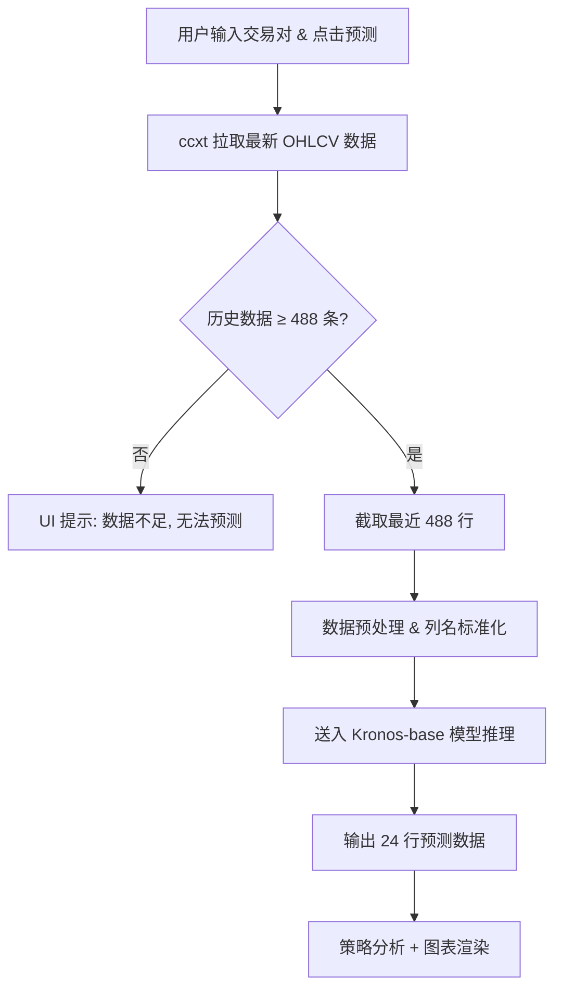
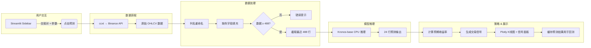

# Crypto-Pilot — 产品需求文档 (PRD)

> **项目名称**：Crypto-Pilot  
> **文档版本**：v1.0  
> **日期**：2026-02-10  
> **作者**：Crypto PM & 量化系统架构组

---

## 目录

1. [产品概述](#1-产品概述-product-overview)
2. [技术规格](#2-技术规格-technical-specifications)
3. [量化策略逻辑](#3-量化策略逻辑-strategy-logic)
4. [UI/UX 交互设计](#4-uiux-交互设计-ui-requirements)
5. [异常处理](#5-异常处理-error-handling)
6. [附录](#6-附录)

---

## 1. 产品概述 (Product Overview)

### 1.1 项目定位

Crypto-Pilot 是一款**本地部署**的通用加密货币价格预测与分析仪表盘，面向个人量化爱好者与交易员。用户在本地笔记本上即可运行完整的预测工作流，无需 GPU 或云端服务。

### 1.2 核心目标

| 目标 | 描述 |
|------|------|
| **实时预测** | 基于 `NeoQuasar/Kronos-base` 时序预测模型，利用过去 ≈20 天的小时级数据，预测未来 24 小时价格走势 |
| **通用币种** | 支持用户输入任意加密货币交易对（如 BTC/USDT、ETH/USDT、SOL/USDT 等） |
| **交易信号** | 根据预测结果，自动生成动态、可配置的 看涨 / 看跌 / 观望 交易信号 |
| **直观可视化** | 通过 Plotly 交互式 K 线图展示历史与预测数据，并提供回测验证（Reality Check） |

### 1.3 技术栈摘要

| 层级 | 技术选型 |
|------|----------|
| 前端框架 | **Streamlit** |
| 预测引擎 | **NeoQuasar/Kronos-base** (HuggingFace, CPU 推理) |
| 数据源 | **ccxt** → Binance 公共 API |
| 图表库 | **Plotly** |
| 运行环境 | 本地笔记本 (CPU / 核显)，**严禁 CUDA 依赖** |

### 1.4 用户画像

- 个人加密货币交易者 / 量化爱好者
- 拥有基本 Python 环境的本地开发机
- 希望快速验证价格趋势并辅助决策

---

## 2. 技术规格 (Technical Specifications)

### 2.1 数据源与采集

| 配置项 | 规格 |
|--------|------|
| API 库 | `ccxt` |
| 交易所 | **Binance**（公共行情 API，无需 API Key） |
| 时间粒度 | **1h**（1 小时 K 线） |
| 默认交易对 | `BTC/USDT` |

> [!IMPORTANT]
> 数据采集使用 Binance 的公共 OHLCV 接口，不涉及任何交易操作，无需用户提供 API Key。

### 2.2 数据预处理规范

#### 2.2.1 列名强制重命名

从 `ccxt` 获取的原始数据必须统一重命名为以下全小写列名：

```python
columns = ['open', 'high', 'low', 'close', 'volume', 'amount']
```

#### 2.2.2 字段缺失处理

| 字段 | 来源 | 缺失处理 |
|------|------|----------|
| `open` | API 直接返回 | — |
| `high` | API 直接返回 | — |
| `low` | API 直接返回 | — |
| `close` | API 直接返回 | — |
| `volume` | API 直接返回 | — |
| `amount` | API 可能不返回 | **必须使用 `close * volume` 进行估算填充** |

```python
if 'amount' not in df.columns or df['amount'].isna().all():
    df['amount'] = df['close'] * df['volume']
```

#### 2.2.3 时间戳序列处理 (Timestamp Handling)

**严重警告**：模型推理不仅需要 OHLCV 数值，还**必须**输入明确的时间戳序列。

- **历史时间戳 (`x_timestamp`)**：
    - 必须提取输入数据对应的 488 个时间点。
- **预测时间戳 (`y_timestamp`)**：
    - **必须**在预处理阶段生成未来 24 小时的时间戳列表。
    - 如果当前最后一条数据时间是 `T`，则 `y_timestamp` 为 `[T+1h, T+2h, ..., T+24h]`。
    - 该参数必须明确传给 `KronosPredictor`，否则模型无法识别时序位置。

### 2.3 模型推理逻辑

> [!CAUTION]
> 以下参数是 Kronos 模型的**硬性约束**，任何环节均不得突破 512 Token 上限，否则模型将报错或产生不可预测的结果。

#### 2.3.1 核心约束

```
┌─────────────────────────────────────────────────────┐
│            Kronos 上下文窗口 (512 Tokens)             │
│                                                     │
│  ┌──────────────────────┐  ┌──────────────────────┐ │
│  │  Input Window: 488   │  │  Output Window: 24   │ │
│  │  (历史数据行数)        │  │  (预测数据行数)       │ │
│  └──────────────────────┘  └──────────────────────┘ │
│                                                     │
│           488 + 24 = 512 ✅ 严格合规                 │
└─────────────────────────────────────────────────────┘
```

| 参数 | 值 | 说明 |
|------|----|------|
| **输入窗口 (Input)** | `488` 行 | 截取最新的 488 条 1h K 线 ≈ 20.3 天 |
| **预测窗口 (Output)** | `24` 行 | 预测未来 24 条 1h K 线 = 24 小时 |
| **总长度** | `512` | 等于模型最大上下文长度，**严禁超标** |

#### 2.3.2 推理流程



#### 2.3.3 模型加载要求

- **核心加载逻辑**：
    - **禁止**使用 `transformers.AutoModel` 等标准接口直接加载模型，必须通过项目内建 `model` 包加载。`transformers` 仅作为 Kronos 框架的间接依赖保留。
    - **必须**使用项目内建的 `model` 包，调用以下核心类：
        - `Kronos`: 模型架构定义
        - `KronosTokenizer`: 负责数据 Tokenization
        - `KronosPredictor`: 负责推理流程封装
- **代码规范**：
    ```python
    from model import Kronos, KronosTokenizer, KronosPredictor
    
    # 初始化
    tokenizer = KronosTokenizer.from_pretrained("NeoQuasar/Kronos-Tokenizer-base")
    model = Kronos.from_pretrained("NeoQuasar/Kronos-base")
    predictor = KronosPredictor(model, tokenizer, device="cpu", max_context=512)
    ```
- **强制 CPU 推理**：`device='cpu'`，严禁使用 CUDA。
- **自动缓存**：首次运行时自动从 HF 下载并缓存。

---

## 3. 量化策略逻辑 (Strategy Logic)

### 3.1 设计原则

> [!IMPORTANT]
> 所有策略参数必须是**动态可调**的，通过 UI 侧边栏实时配置，**严禁硬编码**。

### 3.2 核心变量定义

| 变量名 | 公式 | 说明 |
|--------|------|------|
| `current_price` | `历史数据最后一行的 close` | 当前价格 |
| `predicted_price` | `预测数据最后一行的 close` | 预测 24h 后价格 |
| `expected_return` | `(predicted_price - current_price) / current_price` | 预期收益率 |
| `user_threshold` | 用户在 UI 侧边栏设定 | 信号触发阈值（如 2%） |
| `stop_loss_pct` | 用户在 UI 侧边栏设定 | 止损百分比（如 2%） |

### 3.3 信号定义

```
                        看跌 (Bearish)          观望 (Neutral)          看涨 (Bullish)
                    ◄──────────────────┼──────────────────────────┼──────────────────►
                                 -threshold                +threshold
```

| 信号 | 条件 | UI 展示 |
|------|------|---------|
| 🟢 **看涨 (Bullish)** | `expected_return > +user_threshold` | 绿色标识 + 建议买入 |
| 🔴 **看跌 (Bearish)** | `expected_return < -user_threshold` | 红色标识 + 建议卖出 |
| 🟡 **观望 (Neutral)** | `-user_threshold ≤ expected_return ≤ +user_threshold` | 黄色标识 + 建议持币观望 |

### 3.4 止损位计算

```python
if signal == "Bullish":
    stop_loss_price = current_price * (1 - stop_loss_pct / 100)
elif signal == "Bearish":
    stop_loss_price = current_price * (1 + stop_loss_pct / 100)
else:
    stop_loss_price = None  # 观望状态不设止损
```

### 3.5 信号输出面板

UI 主区域应展示如下信息卡片：

| 输出项 | 示例值 |
|--------|--------|
| 当前价格 | $97,350.00 |
| 预测价格 (24h) | $98,820.00 |
| 预期收益率 | +1.51% |
| 交易信号 | 🟢 看涨 (Bullish) |
| 建议止损价 | $95,403.00 |

### 3.6 参数调优指南 (Parameter Tuning Guide)

> [!TIP]
> `user_threshold`（信号触发阈值）和 `stop_loss_pct`（止损百分比）是直接影响交易信号灵敏度与风险控制的核心参数。以下提供按交易风格分类的推荐值，帮助用户快速上手。

#### 3.6.1 `user_threshold` — 信号触发阈值

**本质**：预期收益率必须超过此阈值才会触发"看涨"或"看跌"信号。阈值越低，信号越敏感（触发频繁）；阈值越高，信号越保守（只在大趋势时触发）。

| 交易风格 | 推荐阈值 | 说明 |
|----------|----------|------|
| 🏎️ **激进型 (Aggressive)** | **0.5% – 1.5%** | 对微小波动也产生信号，适合高频关注、快速反应的短线交易者。信号频繁，但误报率较高 |
| ⚖️ **均衡型 (Balanced)** | **1.5% – 3.0%** | 过滤掉日内噪音，仅在有一定趋势强度时触发。**推荐新手使用此区间，默认值 2.0%** |
| 🛡️ **保守型 (Conservative)** | **3.0% – 5.0%** | 只关注较强的单边行情，忽略小幅震荡。信号稀少但可信度更高 |
| 🏔️ **极端保守型** | **5.0% – 10.0%** | 仅在模型预测出极端大涨/大跌时才触发，适合只想捕捉"黑天鹅"级别行情的用户 |

**调参逻辑**：
- 加密货币 24h **平均波动率约 2%–5%**（BTC 偏低，山寨币偏高）
- 阈值设置应略高于该币种的日常波幅噪音，以避免被随机波动误导
- 对于波动率较高的币种（如 DOGE、SHIB），应适当**上调阈值**（如 3%–5%）
- 对于波动率较低的稳定币种（如 BTC、ETH），可适当**下调阈值**（如 1.5%–2.5%）

#### 3.6.2 `stop_loss_pct` — 止损百分比

**本质**：当信号触发后，止损价格相对于当前价格的最大可接受亏损幅度。止损越小，风险暴露越低但被"扫损"概率越大；止损越大，容忍波动空间更大但单次亏损也更大。

| 交易风格 | 推荐止损 | 说明 |
|----------|----------|------|
| 🏎️ **激进型** | **1% – 2%** | 严格止损，快速止损出场，适合配合高频信号使用。容易被短期波动触发止损 |
| ⚖️ **均衡型** | **2% – 3%** | 在控损与容忍波动之间取得平衡。**推荐新手使用此区间，默认值 2.0%** |
| 🛡️ **保守型** | **3% – 5%** | 给予价格更多呼吸空间，减少被假突破扫损的概率，但单次亏损更大 |
| 🏔️ **宽止损** | **5% – 10%** | 仅在极端反向行情时触发，适合长线持仓或极高信心的交易 |

**调参逻辑**：
- 止损幅度应 **≥ 币种的小时级平均波幅**，否则正常波动就会触发止损
- BTC/ETH 小时波幅通常在 0.3%–1.0%，建议止损 ≥ 2%
- 山寨币小时波幅通常在 1%–3%，建议止损 ≥ 3%
- 经验法则：**止损幅度 ≈ 信号阈值 × 1~1.5 倍**，确保风险回报比合理

#### 3.6.3 参数组合推荐矩阵

| 场景 | `user_threshold` | `stop_loss_pct` | 风险回报特征 |
|------|-------------------|-----------------|-------------|
| BTC 短线波段 | 1.5% | 2.0% | 中频信号，严格风控 |
| BTC 日内趋势 | 2.0% | 2.5% | ⭐ **默认推荐** |
| ETH 趋势跟踪 | 2.0% | 3.0% | 均衡策略 |
| SOL 波段交易 | 3.0% | 4.0% | 适应高波动 |
| 山寨币（DOGE 等）| 5.0% | 5.0% | 仅捕捉强趋势 |
| 极端行情捕捉 | 8.0% | 3.0% | 高阈值低止损，赔率型策略 |

#### 3.6.4 实际案例

假设 BTC 当前价格 **$97,350**，使用默认参数 `user_threshold=2.0%`，`stop_loss_pct=2.0%`：

```
模型预测 24h 后价格: $99,500
预期收益率: ($99,500 - $97,350) / $97,350 = +2.21%

+2.21% > +2.0% (阈值) → 🟢 看涨信号触发
止损价: $97,350 × (1 - 2%) = $95,403
```

```
模型预测 24h 后价格: $96,800
预期收益率: ($96,800 - $97,350) / $97,350 = -0.56%

-2.0% < -0.56% < +2.0% → 🟡 观望（在阈值范围内，不产生信号）
```

```
模型预测 24h 后价格: $94,500
预期收益率: ($94,500 - $97,350) / $97,350 = -2.93%

-2.93% < -2.0% (阈值) → 🔴 看跌信号触发
止损价: $97,350 × (1 + 2%) = $99,297
```

> [!WARNING]
> 以上推荐值仅供参考，不构成投资建议。用户应根据个人风险承受能力、具体币种特性和当前市场环境综合调整。建议先利用**回测验证 (Reality Check)** 功能观察模型在目标币种上的实际预测准确度，再确定合适的参数区间。

---

## 4. UI/UX 交互设计 (UI Requirements)

### 4.1 整体布局

```
┌──────────────┬──────────────────────────────────────────────┐
│              │                                              │
│   Sidebar    │              Main Content Area               │
│              │                                              │
│  ┌────────┐  │  ┌────────────────────────────────────────┐  │
│  │ Symbol │  │  │                                        │  │
│  ├────────┤  │  │          Plotly K线图                    │  │
│  │ 阈值   │  │  │    历史(灰) + 预测(蓝) + 回测(虚线)     │  │
│  ├────────┤  │  │                                        │  │
│  │ 止损%  │  │  └────────────────────────────────────────┘  │
│  ├────────┤  │                                              │
│  │ 预测🚀 │  │  ┌──────┐  ┌──────┐  ┌──────┐  ┌──────┐   │
│  └────────┘  │  │当前价 │  │预测价 │  │收益率 │  │信号  │   │
│              │  └──────┘  └──────┘  └──────┘  └──────┘   │
└──────────────┴──────────────────────────────────────────────┘
```

### 4.2 侧边栏 (Sidebar) 配置

| 控件类型 | 标签 | 默认值 | 范围 / 说明 |
|----------|------|--------|-------------|
| 文本输入框 | 交易对 Symbol | `BTC/USDT` | 支持任意 Binance 交易对格式 |
| 滑动条 | 信号触发阈值 (%) | `2.0%` | 范围 **0.5% – 10%**，步长 0.5% |
| 滑动条 | 止损百分比 (%) | `2.0%` | 范围 **1% – 10%**，步长 0.5% |
| **高级设置 (Advanced Settings)** | (默认折叠) | — | — |
| 滑动条 | Temperature | `1.0` | 范围 0.1 – 2.0，控制生成多样性 |
| 滑动条 | Top_P | `0.9` | 范围 0.1 – 1.0，核采样 |
| 数字输入 | Sample Count | `1` | 默认 1，并行采样数量 |
| 按钮 | 开始预测 🚀 | — | 点击后触发完整预测流程 |

### 4.3 主图表区 (Main Chart)

#### 4.3.1 K 线图规格

| 要素 | 样式 | 说明 |
|------|------|------|
| 历史 K 线 | **灰色** | 最近 488 条历史数据 |
| 预测 K 线 | **蓝色** | 未来 24 条预测数据 |
| 历史 → 预测分界线 | 垂直虚线 | 标注"当前时间"分界点 |
| 图表类型 | Plotly Candlestick | 支持缩放、悬停查看详情 |

#### 4.3.2 回测验证功能 (Reality Check)

> [!NOTE]
> 此功能帮助用户直观评估模型预测的准确度。

| 要素 | 样式 | 说明 |
|------|------|------|
| 昨日预测线 | **橙色虚线** | 24 小时前运行模型时对今日的预测值 |
| 今日实际线 | **实线（原始数据）** | 过去 24 小时的真实收盘价 |

**实现逻辑**：
1. 每次预测时，将预测结果序列化存储至本地文件（如 JSON 或 SQLite）
2. 下次预测时，加载上一次的预测记录
3. 将"上次预测的未来 24h"与"当前已实现的 24h 真实数据"进行对齐叠加
4. 在图表中以橙色虚线绘制历史预测，与灰色实际数据形成对比

### 4.4 信号结果展示

在图表下方，使用 Streamlit 的 `st.columns` + `st.metric` 组件展示：

- **当前价格** — 显示为美元格式
- **预测价格 (24h)** — 显示为美元格式
- **预期收益率** — 显示为百分比，正值绿色、负值红色
- **交易信号** — 带 Emoji 的信号标签（🟢🔴🟡）
- **止损价格** — 根据信号方向计算

---

## 5. 异常处理 (Error Handling)

### 5.1 网络异常

| 场景 | 处理方式 |
|------|----------|
| Binance API 连接超时 | **自动重试**，最多 3 次，每次间隔 2 秒指数退避 |
| 交易对不存在 / 无效 | UI 弹出 `st.error("无效的交易对，请检查输入格式，如 BTC/USDT")` |
| API 返回空数据 | 提示用户检查网络连接与交易对有效性 |

```python
import time

MAX_RETRIES = 3

for attempt in range(MAX_RETRIES):
    try:
        ohlcv = exchange.fetch_ohlcv(symbol, timeframe='1h', limit=500)
        break
    except Exception as e:
        if attempt < MAX_RETRIES - 1:
            time.sleep(2 ** attempt)  # 指数退避: 1s, 2s, 4s
        else:
            st.error(f"网络错误：无法连接 Binance API。详情: {e}")
            st.stop()
```

### 5.2 数据异常

| 场景 | 处理方式 |
|------|----------|
| 历史数据 < 488 条 | UI 显示 `st.warning("⚠️ 数据不足：该币种历史数据不足 488 条，无法进行预测。请尝试更主流的交易对。")` |
| 数据包含 NaN / 缺失值 | 使用前向填充 (`ffill`) + 后向填充 (`bfill`) 处理 |
| 模型推理异常 | 捕获异常并在 UI 提示错误信息，不中断程序运行 |

### 5.3 模型异常

| 场景 | 处理方式 |
|------|----------|
| 模型加载失败 | 提示用户检查网络（首次需下载模型）或磁盘空间 |
| 推理超时 | 设置合理的超时限制，超时后提示用户稍后重试 |
| 输入维度不匹配 | 在送入模型前严格校验输入 shape 为 `(488, 6)` |

---

## 6. 附录

### 6.1 项目依赖 (Python Packages)

```txt
streamlit
ccxt
plotly
pandas
numpy
transformers      # ⚠️ 间接依赖：Kronos 的 from_pretrained() 底层需要 HuggingFace Hub，但禁止直接用它加载模型
torch (CPU-only 版本)
```

> [!WARNING]
> 安装 PyTorch 时，必须选择 **CPU-only** 版本，避免拉取 CUDA 依赖。安装命令：
> ```bash
> pip install torch --index-url https://download.pytorch.org/whl/cpu
> ```

### 6.2 关键常量定义

```python
# config.py
INPUT_WINDOW = 488        # 历史数据行数
OUTPUT_WINDOW = 24        # 预测数据行数
MAX_CONTEXT = 512         # Kronos 最大上下文长度
TIMEFRAME = '1h'          # K线时间粒度
MODEL_NAME = 'NeoQuasar/Kronos-base'  # HuggingFace 模型标识
DEFAULT_SYMBOL = 'BTC/USDT'           # 默认交易对
MAX_RETRIES = 3           # API 最大重试次数
```

### 6.3 本地预测缓存结构 (用于回测验证)

```json
{
  "symbol": "BTC/USDT",
  "predicted_at": "2026-02-10T17:00:00+08:00",
  "predictions": [
    {"timestamp": "2026-02-10T18:00:00", "open": 97400, "high": 97500, "low": 97300, "close": 97450, "volume": 120.5, "amount": 11737225},
    "... (共 24 条)"
  ]
}
```

### 6.4 数据流全景图


