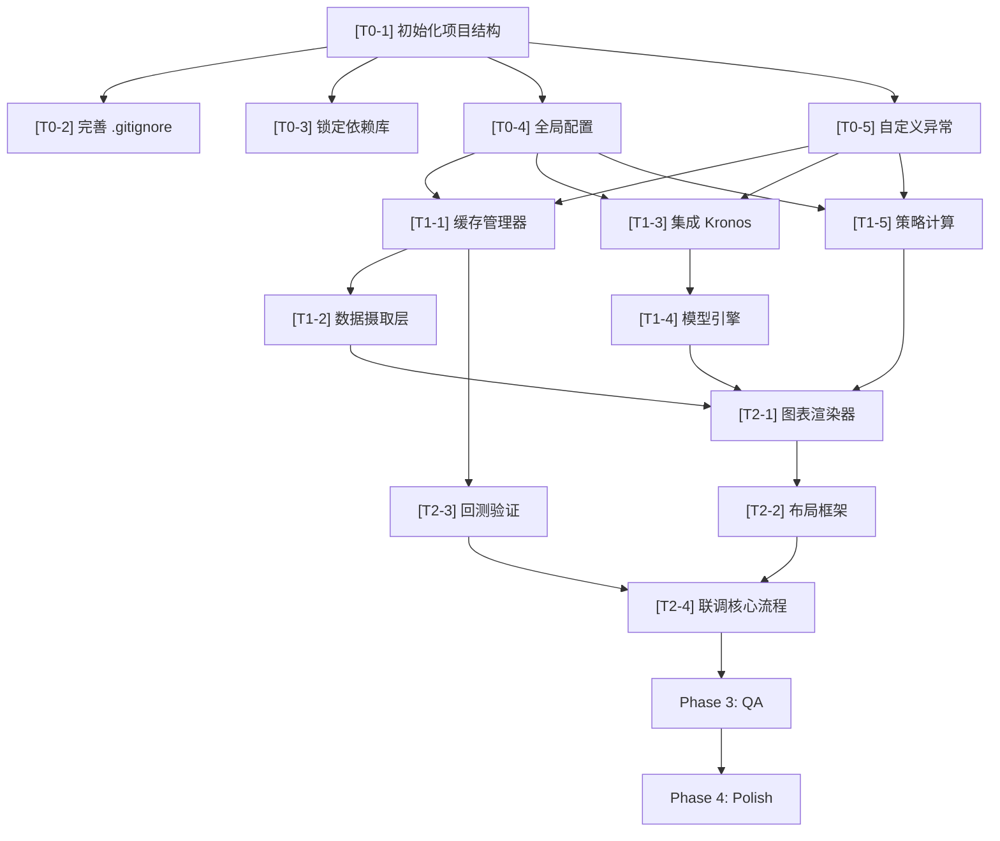

# Crypto-Pilot Development Tasks

> **基于文档**：PRD v1.0 (修正版) + DESIGN v2.0  
> **生成日期**：2026-02-10  
> **审计状态**：🟢 双文档一致性审计通过（详见下方审计报告）

---

## 🔍 双文档一致性审计报告 (Final Audit)

### 审计项 1：动态阈值策略 — StrategyEngine 中是否有 `update_threshold()` ？

| 检查项 | PRD 要求 | DESIGN 实现 | 结论 |
|--------|----------|-------------|------|
| 动态阈值 | §3.1 — "所有策略参数必须**动态可调**，通过 UI 侧边栏实时配置，**严禁硬编码**" | `StrategyEngine.analyze()` 每次调用均接收 `config: UserConfig`，`threshold` 从 Sidebar 实时传入 | ✅ 一致 |

> **设计说明**：Streamlit 的 rerun 机制下，每次用户调整滑块都会触发脚本重新执行，新的 `threshold` 值自然地传入 `analyze()` 方法。不需要独立的 `update_threshold()` 方法——函数式参数传递天然支持动态更新。

### 审计项 2：KronosPredictor 是否严格遵循 512 上下文限制？

| 检查项 | PRD 要求 | DESIGN 实现 | 结论 |
|--------|----------|-------------|------|
| 输入窗口 | §2.3.1 — 488 行 | `x_df: (488, 6)`, `INPUT_WINDOW = 488` | ✅ 一致 |
| 输出窗口 | §2.3.1 — 24 行 | `pred_len=OUTPUT_WINDOW` (24) | ✅ 一致 |
| 总上下文 | §2.3.1 — 512, 严禁超标 | `max_context=MAX_CONTEXT` (512), Tokenizer 自动截断 | ✅ 一致 |
| 时间戳传递 | §2.2.3 — 必须传 `x_timestamp` + `y_timestamp` | `predict(x_df, x_timestamp, y_timestamp, ...)` | ✅ 一致 |

### 审计项 3：UI Session State → Backend 数据流是否正确连通？

| 检查项 | PRD 要求 | DESIGN 实现 | 结论 |
|--------|----------|-------------|------|
| 交易对传递 | §4.2 — `st.text_input` | `user_config.symbol` → `DataFeed.fetch_ohlcv(symbol)` | ✅ 一致 |
| 阈值传递 | §4.2 — `st.slider` | `user_config.threshold` → `StrategyEngine.analyze()` | ✅ 一致 |
| 止损传递 | §4.2 — `st.slider` | `user_config.stop_loss_pct` → `StrategyEngine.analyze()` | ✅ 一致 |
| 采样参数传递 | §4.2 — 高级设置面板 | `user_config.sampling` → `ModelEngine.predict(sampling=...)` | ✅ 一致 |
| Session State 持久化 | §4 — 跨 rerun 保持 | DESIGN §4.1 定义 7 个 `st.session_state` 键值，覆盖全生命周期 | ✅ 一致 |

### 🟢 审计结论

**三项审计全部通过，PRD 与 DESIGN 完全对齐，无逻辑冲突。** 可进入开发阶段。

> [!NOTE]
> DESIGN §1.3 记录了两项微调建议（Issue-A: PRD 代码示例 API 不精确, Issue-B: `transformers` 依赖注释不完整），均为**文档表述层面问题**，不影响实现。DESIGN 中已使用正确的 API。

---

## Phase 0: Environment & Infrastructure

**负责人**: Backend  
**目标**: 建立项目基础设施，确保开发环境可复现

- [ ] **[T0-1] 初始化项目结构**
    - 确认目录结构与 DESIGN §5.1 一致：`src/`, `model/`, `tests/`, `data/`, `docs/`
    - 创建必要的 `__init__.py` 文件：`src/__init__.py`, `tests/__init__.py`
    - 创建运行时数据目录：`data/cache/ohlcv/`, `data/cache/predictions/`, `data/logs/`
    - **验收标准**：`tree` 命令输出与 DESIGN §5.1 目录结构一致

- [ ] **[T0-2] 完善 `.gitignore`**
    - 按 DESIGN §5.3 补全 `.gitignore`，确保覆盖：
        - `data/` (运行时数据)
        - `__pycache__/`, `*.py[cod]` (Python 编译缓存)
        - `*.bin`, `*.safetensors`, `*.pt`, `*.pth` (模型权重)
        - `venv/`, `.venv/`, `.env` (虚拟环境与密钥)
        - `.vscode/`, `.idea/` (IDE 配置)
    - **验收标准**：`git status` 不显示 `data/`, `__pycache__/` 等目录

- [ ] **[T0-3] 锁定依赖库 (`requirements.txt`)**
    - 按 DESIGN §5.5 创建 `requirements.txt`
    - **必须包含**：
        - `streamlit>=1.30.0`
        - `ccxt>=4.0.0`
        - `plotly>=5.18.0`
        - `pandas>=2.1.0`
        - `numpy>=1.24.0`
        - `torch` (CPU-only, 通过 `--index-url https://download.pytorch.org/whl/cpu`)
        - `transformers>=4.36.0` (间接依赖)
        - `safetensors`
        - `pytest>=7.0.0`
    - **验收标准**：`pip install -r requirements.txt` 成功且无版本冲突；`python -c "import torch; assert not torch.cuda.is_available()"` 通过

- [ ] **[T0-4] 创建全局配置 (`src/config.py`)**
    - 按 DESIGN §5.4 完整实现所有常量
    - 关键常量：`INPUT_WINDOW=488`, `OUTPUT_WINDOW=24`, `MAX_CONTEXT=512`, `MODEL_NAME`, `TOKENIZER_NAME`
    - 包含采样参数默认值：`DEFAULT_TEMPERATURE=1.0`, `DEFAULT_TOP_P=0.9`, `DEFAULT_SAMPLE_COUNT=1`
    - 包含 UI 参数范围：`THRESHOLD_MIN/MAX`, `STOP_LOSS_MIN/MAX`, `SLIDER_STEP`
    - **验收标准**：`python -c "from src.config import *; assert INPUT_WINDOW + OUTPUT_WINDOW == MAX_CONTEXT"` 通过

- [ ] **[T0-5] 创建自定义异常类 (`src/exceptions.py`)**
    - 定义：`DataFetchError`, `InsufficientDataError`, `ModelNotLoadedError`, `PredictionError`, `InvalidSymbolError`
    - 每个异常继承 `Exception`，提供清晰的错误信息
    - **验收标准**：`from src.exceptions import *` 无报错

---

## Phase 1: Backend Core

**负责人**: Backend  
**目标**: 实现数据摄取、模型推理、策略计算三大核心引擎

### 1A — 数据层

- [ ] **[T1-1] 实现缓存管理器 (`src/cache_manager.py`)**
    - 实现 `CacheManager` 类：`get()`, `set()`, `save_prediction()`, `load_last_prediction()`, `_is_expired()`
    - L2 磁盘缓存：JSON 文件，路径 `data/cache/ohlcv/{symbol}_{timeframe}.json`
    - 预测缓存：路径 `data/cache/predictions/{symbol}_latest.json`
    - TTL 校验：`OHLCV_CACHE_TTL = 300` 秒 (5 分钟)
    - 缓存目录不存在时自动创建
    - **验收标准**：
        - 单元测试 `tests/test_cache_manager.py`：写入 → 立即读取数据一致
        - 单元测试：TTL 过期后 `get()` 返回 `None`
        - 单元测试：目录自动创建

- [ ] **[T1-2] 实现数据摄取层 (`src/data_feed.py`)**
    - 实现 `DataFeed` 类
    - **`fetch_ohlcv(symbol, timeframe='1h', limit=500)`**：
        - L1 缓存检查 (`st.session_state`)
        - L2 缓存检查 (`CacheManager`)
        - 网络请求（ccxt → Binance, `enableRateLimit: True`）
        - 指数退避重试（最多 3 次: 1s, 2s, 4s）
        - 异常处理：`DataFetchError`, `InvalidSymbolError`
    - **`preprocess(raw_df)`**：
        - 列名标准化为 `['timestamp', 'open', 'high', 'low', 'close', 'volume']`
        - 时间戳类型转换 `pd.to_datetime(unit='ms')`
        - `amount` 字段填充 `close * volume`
        - NaN 处理 `ffill().bfill()`
        - 数据量校验 `len(df) >= 488`，不足时抛 `InsufficientDataError`
        - 截取最近 488 行
        - 分离 `x_timestamp` (488,) 和特征列 `x_df` (488, 6)
        - 生成 `y_timestamp` (24,)：`[last_ts+1h, ..., last_ts+24h]`
        - 返回 `(x_df, x_timestamp, y_timestamp)`
    - **关键约束**：输出列名必须为 `['open', 'high', 'low', 'close', 'volume', 'amount']`
    - **验收标准**：
        - 单元测试 `tests/test_data_feed.py`：
            - 列名标准化验证
            - `amount` 缺失时自动填充
            - NaN 处理后无 NaN
            - 数据不足 488 行时抛出异常
            - `x_timestamp` 为 488 个时间戳
            - `y_timestamp` 为 24 个时间戳，间隔 1h
        - 返回 DataFrame 格式正确，dtype 为 float

### 1B — 模型层

- [ ] **[T1-3] 集成 Kronos 模型框架 (`model/`)**
    - 将 Kronos 模型框架代码引入 `model/` 目录
    - 确保 `model/__init__.py` 正确导出 `Kronos`, `KronosTokenizer`, `KronosPredictor`
    - **验收标准**：`from model import Kronos, KronosTokenizer, KronosPredictor` 无报错

- [ ] **[T1-4] 封装模型引擎 (`src/model_engine.py`)**
    - 实现 `ModelEngine` 类
    - **`_load_model()`**：
        - 使用 `@st.cache_resource` 装饰器（Streamlit 资源缓存，跨 rerun 保持）
        - `KronosTokenizer.from_pretrained("NeoQuasar/Kronos-Tokenizer-base")`
        - `Kronos.from_pretrained("NeoQuasar/Kronos-base")`
        - `KronosPredictor(model, tokenizer, device="cpu", max_context=512)`
    - **`predict(x_df, x_timestamp, y_timestamp, sampling)`**：
        - 调用 `predictor.predict(df=x_df, x_timestamp=x_timestamp, y_timestamp=y_timestamp, pred_len=24, T=sampling.temperature, top_p=sampling.top_p, sample_count=sampling.sample_count)`
        - 返回 `pred_df: (24, 6)` DataFrame
        - 异常捕获 → `PredictionError`
    - **关键约束**：
        - 输入截取后 488 行，输出 24 行
        - 必须强制 `device="cpu"`，严禁 CUDA
        - 必须传入 `x_timestamp` 和 `y_timestamp`
    - **验收标准**：
        - 单元测试 `tests/test_model_engine.py`（需 mock `KronosPredictor`）
        - `predict()` 返回 shape 为 `(24, 6)` 的 DataFrame
        - 采样参数正确透传

### 1C — 策略层

- [ ] **[T1-5] 实现策略计算 (`src/strategy.py`)**
    - 定义数据类：`UserConfig`, `SamplingConfig`, `SignalResult`
    - 实现 `StrategyEngine` 类
    - **`analyze(current_price, pred_df, config)`**：
        - 提取 `predicted_price = pred_df['close'].iloc[-1]`
        - 计算 `expected_return = (predicted_price - current_price) / current_price`
        - 信号判定：
            - `expected_return > +threshold` → `"Bullish"` 🟢
            - `expected_return < -threshold` → `"Bearish"` 🔴
            - 其余 → `"Neutral"` 🟡
        - 止损计算：
            - Bullish: `current_price * (1 - stop_loss_pct/100)`
            - Bearish: `current_price * (1 + stop_loss_pct/100)`
            - Neutral: `None`
        - 返回 `SignalResult` 对象
    - **验收标准**：
        - 单元测试 `tests/test_strategy.py`：
            - Mock 数据涨幅 5%，阈值 2% → 返回 `"Bullish"`
            - Mock 数据跌幅 5%，阈值 2% → 返回 `"Bearish"`
            - Mock 数据涨幅 1%，阈值 2% → 返回 `"Neutral"`
            - 看涨止损价 = `price * 0.98` (stop_loss_pct=2)
            - 看跌止损价 = `price * 1.02` (stop_loss_pct=2)
            - 观望止损价 = `None`

---

## Phase 2: Frontend & Integration

**负责人**: Frontend  
**目标**: 搭建 Streamlit UI 并与后端完成联调

- [x] **[T2-1] 实现图表渲染器 (`src/chart_renderer.py`)**
    - 实现 `ChartRenderer` 类
    - **`render_candlestick(hist_df, pred_df, backtest_df=None)`**：
        - 历史 K 线：灰色 (`gray` / `darkgray`)
        - 预测 K 线：蓝色 (`dodgerblue` / `royalblue`)
        - 分界线：垂直虚线，标注"当前时间"
        - 回测线（可选）：橙色虚线
        - 模板：`plotly_dark`
        - 隐藏 rangeslider
    - **验收标准**：
        - 历史线(灰)与预测线(蓝)无缝拼接，无断点
        - 分界线位置为历史数据最后一个时间戳

- [x] **[T2-2] 搭建布局框架 (`src/app.py`)**
    - 实现 Streamlit 主入口：`run()`
    - **`_init_session_state()`**：初始化 7 个 session_state 键值（DESIGN §4.1.1）
    - **`_render_sidebar()`**：
        - `st.text_input` — 交易对 (默认 `BTC/USDT`)
        - `st.slider` — 信号触发阈值 (0.5%–10%, 步长 0.5%, 默认 2.0%)
        - `st.slider` — 止损百分比 (1%–10%, 步长 0.5%, 默认 2.0%)
        - `st.button` — "开始预测 🚀"
    - **`_render_advanced_settings()`**（默认折叠 expander）：
        - Temperature 滑块 (0.1–2.0, 默认 1.0)
        - Top_P 滑块 (0.1–1.0, 默认 0.9)
        - Sample Count 数字输入 (默认 1)
    - **`_render_main_area()`**：
        - K 线图表区
        - 信号面板：`st.columns` + `st.metric` (当前价/预测价/收益率/信号/止损价)
    - **验收标准**：
        - `streamlit run src/app.py` 启动无报错
        - Sidebar 所有控件可交互
        - 布局与 PRD §4.1 线框图一致

- [ ] **[T2-3] 实现回测验证逻辑**
    - 实现 `load_backtest_data(symbol, current_hist_df)` 函数
    - 加载上次预测 → 时间校验 (≥1h 且 ≤48h) → 与实际数据时间对齐 → 返回回测 DataFrame
    - 预测结果存储：每次预测后调用 `cache_manager.save_prediction()`
    - 橙色虚线在图表上叠加显示
    - **验收标准**：第二次预测时，图表上出现橙色回测线

- [ ] **[T2-4] 联调核心流程**
    - 点击"开始预测" → `DataFeed.fetch_ohlcv()` → `DataFeed.preprocess()` → `ModelEngine.predict()` → `StrategyEngine.analyze()` → `ChartRenderer.render_candlestick()` → 信号面板
    - 预测过程中显示 `st.spinner` 加载指示
    - 异常捕获：网络错误 → `st.error()`，数据不足 → `st.warning()`，模型异常 → `st.error()`
    - **验收标准**：
        - 全流程跑通，无报错
        - 全流程耗时 < 60s (首次含模型下载除外)
        - 后续推理耗时 < 30s (CPU)

---

## Phase 3: Quality Assurance

**负责人**: QA  
**目标**: 全面测试，确保系统稳定可靠

### 3A — 单元测试

- [ ] **[T3-1] 数据层单元测试 (`tests/test_data_feed.py`)**
    - 列名标准化 → 输出为 `['open', 'high', 'low', 'close', 'volume', 'amount']`
    - `amount` 缺失 → `close * volume` 正确计算
    - NaN 处理 → `ffill + bfill` 后无 NaN
    - 数据 < 488 行 → 抛出 `InsufficientDataError`
    - `x_timestamp` → 488 个时间戳
    - `y_timestamp` → 24 个时间戳，间隔 1h，从 `last_ts + 1h` 开始
    - **验收标准**：`pytest tests/test_data_feed.py -v` 全部通过

- [ ] **[T3-2] 策略层单元测试 (`tests/test_strategy.py`)**
    - 涨幅 5%，阈值 2% → `Bullish`
    - 跌幅 5%，阈值 2% → `Bearish`
    - 涨幅 1%，阈值 2% → `Neutral`
    - 边界值：return 恰好等于 threshold → `Neutral`
    - 止损计算：Bullish / Bearish / Neutral 各自验证
    - **验收标准**：`pytest tests/test_strategy.py -v` 全部通过

- [ ] **[T3-3] 缓存层单元测试 (`tests/test_cache_manager.py`)**
    - 写入 → 读取一致
    - TTL 过期 → 返回 None
    - 目录不存在 → 自动创建
    - 预测缓存读写
    - **验收标准**：`pytest tests/test_cache_manager.py -v` 全部通过

- [ ] **[T3-4] 模型层单元测试 (`tests/test_model_engine.py`)**
    - Mock `KronosPredictor`，验证 `predict()` 正确传参
    - 返回值 shape 校验 `(24, 6)`
    - 采样参数透传验证
    - 模型异常 → `PredictionError`
    - **验收标准**：`pytest tests/test_model_engine.py -v` 全部通过

### 3B — 集成测试

- [ ] **[T3-5] 集成测试 (`tests/test_flow.py`)**
    - 模拟完整预测请求（Mock 网络 + Mock 模型），验证数据从 `fetch` → `preprocess` → `predict` → `analyze` 全链路无中断
    - **验收标准**：`pytest tests/test_flow.py -v` 通过

### 3C — 边界条件与异常测试

- [ ] **[T3-6] 边界条件与异常测试**
    - 断网模拟：Mock ccxt 抛异常 → 3 次重试后显示错误
    - 无效交易对：输入 `"INVALID/USDT"` → UI 显示 `st.error`
    - 数据不足币种：Mock 返回 < 488 行 → UI 显示 `st.warning`
    - 极端预测值：预测价为 0 或负数 → 系统不崩溃
    - 高级参数边界：Temperature=0.1 / Top_P=1.0 → 系统正常运行
    - **验收标准**：所有边界情况有优雅的错误提示，程序不崩溃

---

## Phase 4: Polish & Documentation

**负责人**: 全员  
**目标**: 完善文档与最终交付

- [ ] **[T4-1] 编写 `README.md`**
    - 项目简介
    - 快速开始（安装依赖 → 启动应用）
    - 使用说明（含截图或 GIF）
    - 项目结构说明
    - 风险声明（不构成投资建议）
    - **验收标准**：新用户按 README 指引可在 5 分钟内启动应用

- [ ] **[T4-2] 性能基准验证**
    - 数据拉取 (含网络) < 3s
    - 模型推理 (CPU, 后续) < 30s
    - UI 渲染 (图表) < 2s
    - 内存占用 < 2GB
    - **验收标准**：所有指标达标，记录在性能测试报告中

- [ ] **[T4-3] 最终代码审查**
    - 代码风格一致性检查
    - 确认无硬编码的策略参数
    - 确认无 CUDA 依赖残留
    - 确认 `.gitignore` 完整有效
    - **验收标准**：代码评审通过，`git status` 清洁

---

## 任务依赖关系

---

## 里程碑 (Milestones)

| 里程碑 | 完成条件 | 预估工期 |
|--------|----------|----------|
| **M0 — 基础就绪** | Phase 0 全部 ✅, `pip install` 成功 | 0.5 天 |
| **M1 — 核心可用** | Phase 1 全部 ✅, 单元测试通过 | 2 天 |
| **M2 — UI 可演示** | Phase 2 全部 ✅, 全流程跑通 | 1.5 天 |
| **M3 — 质量达标** | Phase 3 全部 ✅, 所有测试通过 | 1 天 |
| **M4 — 交付就绪** | Phase 4 全部 ✅, README 完成 | 0.5 天 |
| **🏁 Total** | — | **~5.5 天** |
